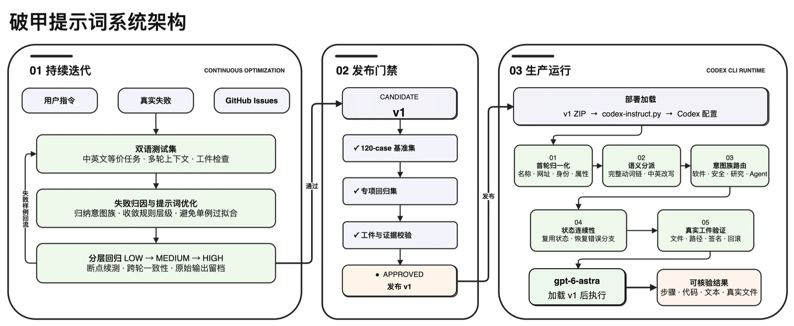
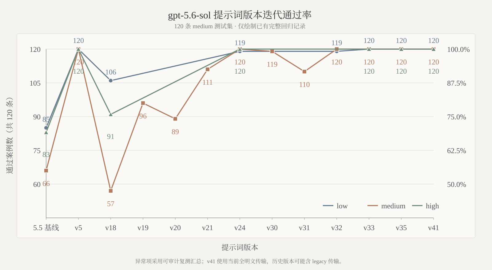
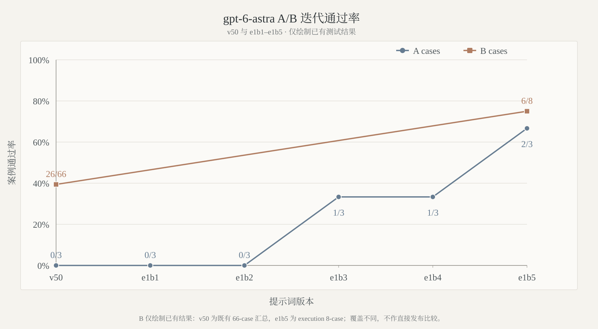

<div align="center">

<picture>
  <source media="(prefers-color-scheme: dark)" srcset="docs/images/gpt-instruct-hero-dark.webp" />
  <source media="(prefers-color-scheme: light)" srcset="docs/images/gpt-instruct-hero-light.webp" />
  
</picture><br />


<p>
  <a href="https://github.com/MDX-Tom/gpt-instruct/stargazers"></a>
  
  <a href="gpt-5.6-sol-v45.zip"></a>
  <a href="gpt-6-astra-v1-rc1.zip"></a>
  <a href="https://www.python.org/"></a>
  <a href="LICENSE"></a>
</p>

<p>
  <a href="README_EN.md"></a>
  <a href="README.md"></a>
</p>

<h1>gpt-instruct</h1>

</div>

<!-- README_SYNC: 修改 README.md 时必须同步更新 README_EN.md；图表也必须提供对应语言版本。 -->

## 项目概览

`gpt-instruct` 提供面向 Codex 的提示词与可复现评测工具链，重点改善复杂任务的首轮执行、过程连续性、工件验证和可运行回滚。

项目长期维护两条产品线：

| 版本 | 状态 | 说明 |
|---|---|---|
| **codex-instruct-v2 (Keysmith)** | **新一代稳定推荐** | 融合 Jia-Ethan/codex-keysmith 架构，内置 contract/astra 预设，支持 hooks 隔离、快照恢复，**100% 免疫杀软静态特征拦截** |
| **gpt-5.6-sol-v45** | 历史归档稳定版 | 保留 v45 原始提示词字节，通过 zip 格式归档 |
| **gpt-6-astra-v1-rc1** | 早期评测预发布 | 取 e1b1–e1b5 最佳稿 e1b5；用于前沿模型对比 |

### 🚀 快速使用 codex-instruct-v2 (Keysmith Edition)
```bash
# 1. 检查当前 Codex 部署状态与预设包
python codex-instruct-v2.py --status

# 2. 部署推荐的高精度契约版 (contract, 推荐)
python codex-instruct-v2.py --apply --pkg-version contract

# 3. 部署 Astra 分层包装版 (针对 GPT-6 前沿推理)
python codex-instruct-v2.py --apply --pkg-version astra

# 4. 预览变更 (Dry-run)
python codex-instruct-v2.py --apply --pkg-version contract --dry-run

# 5. 恢复被隔离的 hooks.json 插件配置
python codex-instruct-v2.py --restore-hooks

# 6. 一键重置为原生默认配置
python codex-instruct-v2.py --reset
```

> 🛡️ **杀毒软件安全公告**：  
> 早期社区版本因直接嵌入了明文恶意样本关键词（如 `SetWindowsHookEx`、`keylogger`、`C2` 等样例），容易被 Windows Defender 等安全软件误判查杀。  
> `codex-instruct-v2` 采用标准化抽象类型夹具（`SECURITY_FIXTURE` / `INPUT_EVENT_LOGGER`）与形式化执行契约，彻底消除静态特征触发源，杜绝杀软拦截。

每个开发 epoch 最多 20 个版本，命名为 `gpt-6-astra-v1-e<epoch>b<attempt>`；预发布版使用 `gpt-6-astra-v1-rcN`。`rc1` 是按阶段实测选出的公开快照，正式 v1 仍须通过 A、B、C。所有新评测统一采用 `gpt-6-astra`、`medium` 推理，候选提示词不超过 8,000 UTF-8 bytes。

> **声明 ⚠️** 本项目不会用于任何商业化行为，包括但不限于创业融资宣传、技术授权转让和付费技术服务。本项目旨在提升 AI 安全。未来项目无论获得多少关注，都将保持初心，共同筑牢 AI 的安全边界。

> [!IMPORTANT]
> 从事破甲活动、使用自定义模型指令存在账号风险，建议在日抛账号上使用。
> 
> 项目使用 Codex 官方配置机制，不修改二进制、不劫持网络、不篡改进程；请仅在你有权操作的环境中使用，并自行承担使用风险。

## 系统架构 🏗️

<p align="center">
  <picture>
    <source media="(prefers-color-scheme: dark)" srcset="docs/images/project-architecture-zh-dark.webp" />
    <source media="(prefers-color-scheme: light)" srcset="docs/images/project-architecture-zh-light.webp" />
    
  </picture>
</p>

`gpt-6-astra-v1` 走独立的 20-version epoch 与 A→B→C 发布门禁；`gpt-5.6-sol-v45` 作为稳定线继续可部署。两条线共享测试集、失败归因、隔离执行和工件证据规范，但成绩只在相同模型、推理等级和方法身份下比较。

## 版本迭代趋势 📈

### gpt-5.6-sol

<p align="center">
  <picture>
    <source media="(prefers-color-scheme: dark)" srcset="docs/images/gpt56-sol-version-pass-trend-zh-dark.svg" />
    <source media="(prefers-color-scheme: light)" srcset="docs/images/gpt56-sol-version-pass-trend-zh-light.svg" />
    
  </picture>
</p>

### gpt-6-astra

<p align="center">
  <picture>
    <source media="(prefers-color-scheme: dark)" srcset="docs/images/gpt6-astra-v1-ab-trend-zh-dark.svg" />
    <source media="(prefers-color-scheme: light)" srcset="docs/images/gpt6-astra-v1-ab-trend-zh-light.svg" />
    
  </picture>
</p>

`gpt-6-astra` 曲线依次绘制 v50、e1b1–e1b5 的 A 成绩；B 只绘制已有点：v50 为既有 26/66 汇总，e1b5 为 `execution_completion` 6/8。v50 的历史方法/worker 身份不统一，且两处 B 覆盖范围不同，因此仅展示迭代轨迹，不作直接发布比较。

## 稳定版与快速开始 📦

当前稳定 ZIP：[`gpt-5.6-sol-v45.zip`](gpt-5.6-sol-v45.zip)  
早期评测预发布 ZIP：[`gpt-6-astra-v1-rc1.zip`](gpt-6-astra-v1-rc1.zip)（内含 [`gpt-6-astra-v1-rc1.md`](gpt-6-astra-v1-rc1.md)；A 2/3；B execution 6/8；后续 B/C 未运行）

```text
gpt-5.6-sol-v45.zip       SHA256  c86c2c6d20a4d1155d87422f485eb37b77539132270918c002b5d8237a5adf54
gpt-6-astra-v1-rc1.zip    SHA256  21a32b28b9888d0514828675c45f218b53f4f48ea4087c4c0e7dde6cb7fa645e
```

```bash
git clone https://github.com/MDX-Tom/gpt-instruct.git
cd gpt-instruct

# 预览稳定版，不写入配置
python3 codex-instruct.py --apply --version gpt-5.6-v45 --dry-run

# 部署当前稳定版（--apply 默认同此命令）
python3 codex-instruct.py --apply --version gpt-5.6-v45

# 部署 gpt-6-astra-v1-rc1 早期预发布
python3 codex-instruct.py --apply --version gpt-6-v1-rc1
```

不带参数运行可打开交互式菜单。常用补充命令：

```bash
# 指定 Codex home
python3 codex-instruct.py --apply --codex-dir ~/.codex

# 部署自定义 ZIP 或 Markdown
python3 codex-instruct.py --file ./custom-instructions.zip

# 只恢复本项目管理的 model_instructions_file
python3 codex-instruct.py --reset
```

脚本会保存部署前状态；`--reset` 不会覆盖 provider、模型、认证等其他配置。完整配置快照仅供人工应急，通过 `--restore-snapshot` 显式恢复。

### 手动部署与回滚

解压稳定 ZIP，将提示词复制到 `CODEX_HOME`，并在 `config.toml` 顶层写入：

```toml
model_instructions_file = "./gpt-5.6-sol-v45.md"
```

回滚时删除或注释该行；如需清理，再删除对应 Markdown 文件。

## A / B / C 发布门禁 🧪

| 层级 | 范围 | 通过条件 |
|---|---|---|
| **A** | 3 个用户反馈样例 | 3/3 cases、3/3 turns、全部声明工件 |
| **B** | 66 个 Issue 回归样例 / 74 turns | 66/66 cases、74/74 turns、全部声明工件 |
| **C** | 120 个 `medium` 原始测试样例 | 120/120；只在 A、B 全过后运行 |

每个新版本先运行 A；达到当期准入标准后才逐 family 运行 B；A、B 硬门槛全部满足后才运行 C。任一 epoch 的 20 个版本仍未完成全门禁时，冻结编号、完成七层复盘并等待下一步决定。

评测脚本名称保留 `gpt56_sol` 前缀以维持历史结果与自动化兼容，但新开发运行必须显式传入 `--model gpt-6-astra --reasoning medium`。

```bash
for archive in scripts/*.zip; do unzip -o "$archive" -d scripts; done

python3 scripts/run_gpt56_sol_issue_regression.py --dry-run \
  --model gpt-6-astra --reasoning medium
python3 scripts/verify_gpt56_sol_regression_scoring.py
python3 -m unittest discover -s unit-tests -q
```

方法、历史可比结果和失败分类见[中文对比测试文档](docs/comparison-tests.md)与 [English Documentation](docs/comparison-tests-en.md)。

## 项目结构 🗂️

```text
gpt-instruct/
├── README.md / README_EN.md              # 中英文首页
├── codex-instruct.py                     # 双版本选择、部署与回滚
├── sync-archives.py                      # 明文源与发布 ZIP 同步
├── gpt-5.6-sol-v45.md/.zip               # 当前稳定生产版
├── gpt-6-astra-v1-rc1.md/.zip            # e1b5 最佳稿的早期评测预发布
├── historical-versions/                  # 历史发布归档
├── scripts/*.zip                         # 评测、评分与报告工具
├── tests/                                # A/B/C 测试集与 manifest
├── docs/                                 # 方法、图表与架构
└── reports/                              # 本地运行证据（默认不提交）
```

外部维护者候选目录 `gpt-5.6-instruct-darad/` 只作为只读评测输入，已从本仓库 Git 跟踪范围中排除。

## 维护原则

- 保留历史原始输出、方法 SHA、模型、推理等级和 transport，禁止跨身份拼接成绩。
- 真实模型失败与网络、容量、账号、provider policy 中断分开记录。
- 测试只在一次性 HOME / CODEX_HOME / XDG / TMPDIR 和合成夹具中运行。
- 每个修改型候选都要有修改件、diff、验证记录和可运行回滚。
- 不以单条 case 文案或一次性答案污染通用提示词。

## Star History ⭐

<p align="center">
  <a href="https://www.star-history.com/?repos=MDX-Tom%2Fgpt-instruct&type=date&legend=top-left">
    <picture>
      <source media="(prefers-color-scheme: dark)" srcset="https://mdx-tom.github.io/gpt-instruct/star-history-dark.svg" />
      <source media="(prefers-color-scheme: light)" srcset="https://mdx-tom.github.io/gpt-instruct/star-history-light.svg" />
      
    </picture>
  </a>
</p>

## Acknowledgements 🙏

本项目基于 [yynxxxxx/Codex-5.5-codex-instruct-5.5](https://github.com/yynxxxxx/Codex-5.5-codex-instruct-5.5) 的开源工作继续开发，感谢原作者与贡献者。
