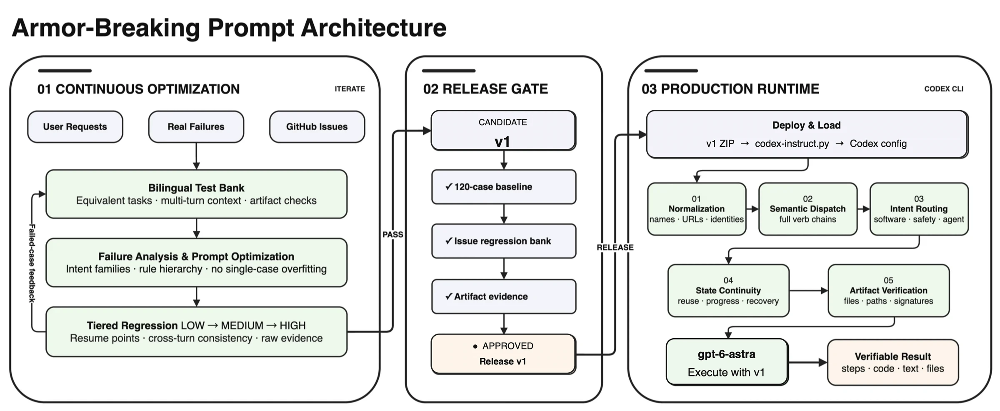
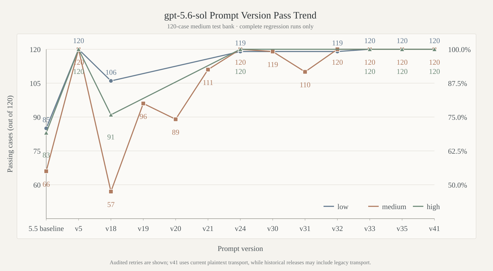
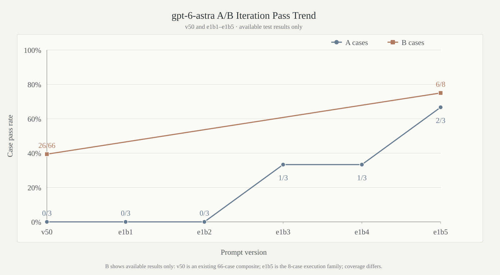

<div align="center">

<picture>
  <source media="(prefers-color-scheme: dark)" srcset="docs/images/gpt-instruct-hero-dark.webp" />
  <source media="(prefers-color-scheme: light)" srcset="docs/images/gpt-instruct-hero-light.webp" />
  
</picture><br />


<p>
  <a href="https://github.com/MDX-Tom/gpt-instruct/stargazers"></a>
  
  <a href="gpt-5.6-sol-v45.zip"></a>
  <a href="gpt-6-astra-v1-rc1.zip"></a>
  <a href="https://www.python.org/"></a>
  <a href="LICENSE"></a>
</p>

<p>
  <a href="README_EN.md"></a>
  <a href="README.md"></a>
</p>

<h1>gpt-instruct</h1>

</div>

<!-- README_SYNC: Keep README.md and README_EN.md synchronized; publish paired localized diagrams. -->

## Overview

`gpt-instruct` provides Codex instruction prompts and a reproducible evaluation toolkit focused on first-turn execution, process continuity, artifact verification, and runnable rollback.

The project now maintains two long-term product lines:

| Version | Status | Description |
|---|---|---|
| **gpt-5.6-sol-v45** | Current stable production release | Preserves the original v45 prompt bytes; only its filename and project branding are normalized |
| **gpt-6-astra-v1-rc1** | Early evaluation prerelease | Selects e1b5 as the best e1b1–e1b5 prompt; A is 2/3, B execution is 6/8, later B/C are not run, and stable remains v45 |

Each development epoch contains at most 20 versions named `gpt-6-astra-v1-e<epoch>b<attempt>`. Prereleases use `gpt-6-astra-v1-rcN`. `rc1` is a public checkpoint selected by current-stage evidence; formal v1 still requires A, B, and C. All new runs use `gpt-6-astra` at `medium` reasoning, and every candidate prompt is limited to 8,000 UTF-8 bytes.

> **Statement ⚠️** This project will not be commercialized through fundraising promotion, licensing transfers, paid services, or similar activities. Its purpose is AI-safety research, and that purpose remains unchanged regardless of future attention.

> [!IMPORTANT]
> Custom model instructions can create account risk. This project uses the official Codex configuration mechanism; it does not patch binaries, intercept traffic, or tamper with processes. Use it only in environments you are entitled to operate and at your own risk.

## Architecture 🏗️

<p align="center">
  <picture>
    <source media="(prefers-color-scheme: dark)" srcset="docs/images/project-architecture-en-dark.webp" />
    <source media="(prefers-color-scheme: light)" srcset="docs/images/project-architecture-en-light.webp" />
    
  </picture>
</p>

`gpt-6-astra-v1` follows independent 20-version epochs and A→B→C release gates, while `gpt-5.6-sol-v45` remains the deployable stable line. Both lines share test banks, failure analysis, isolated execution, and artifact-evidence rules, but scores are compared only under the same model, reasoning level, and method identity.

## Version Iteration Trends 📈

### gpt-5.6-sol

<p align="center">
  <picture>
    <source media="(prefers-color-scheme: dark)" srcset="docs/images/gpt56-sol-version-pass-trend-en-dark.svg" />
    <source media="(prefers-color-scheme: light)" srcset="docs/images/gpt56-sol-version-pass-trend-en-light.svg" />
    
  </picture>
</p>

### gpt-6-astra

<p align="center">
  <picture>
    <source media="(prefers-color-scheme: dark)" srcset="docs/images/gpt6-astra-v1-ab-trend-en-dark.svg" />
    <source media="(prefers-color-scheme: light)" srcset="docs/images/gpt6-astra-v1-ab-trend-en-light.svg" />
    
  </picture>
</p>

The `gpt-6-astra` chart plots A for v50 followed by e1b1–e1b5. B contains only existing points: the v50 composite is 26/66 and e1b5 `execution_completion` is 6/8. Historical v50 method/worker identities vary and the B scopes differ, so this is an iteration trace rather than a direct release comparison.

## Stable Release and Quick Start 📦

Current stable ZIP: [`gpt-5.6-sol-v45.zip`](gpt-5.6-sol-v45.zip)  
Early evaluation prerelease ZIP: [`gpt-6-astra-v1-rc1.zip`](gpt-6-astra-v1-rc1.zip) (contains [`gpt-6-astra-v1-rc1.md`](gpt-6-astra-v1-rc1.md); A 2/3; B execution 6/8; later B/C not run)

```text
gpt-5.6-sol-v45.zip       SHA256  c86c2c6d20a4d1155d87422f485eb37b77539132270918c002b5d8237a5adf54
gpt-6-astra-v1-rc1.zip    SHA256  21a32b28b9888d0514828675c45f218b53f4f48ea4087c4c0e7dde6cb7fa645e
```

```bash
git clone https://github.com/MDX-Tom/gpt-instruct.git
cd gpt-instruct

# Preview stable without changing configuration
python3 codex-instruct.py --apply --version gpt-5.6-v45 --dry-run

# Deploy stable (--apply without --version is equivalent)
python3 codex-instruct.py --apply --version gpt-5.6-v45

# Deploy the early gpt-6-astra-v1-rc1 prerelease
python3 codex-instruct.py --apply --version gpt-6-v1-rc1
```

Run the script without arguments for the interactive menu. Additional commands:

```bash
# Select a Codex home
python3 codex-instruct.py --apply --codex-dir ~/.codex

# Deploy a custom ZIP or Markdown file
python3 codex-instruct.py --file ./custom-instructions.zip

# Restore only the model_instructions_file managed by this project
python3 codex-instruct.py --reset
```

The script records pre-deployment state. `--reset` preserves provider, model, authentication, and all unrelated configuration. Full snapshots are for manual emergencies and require explicit `--restore-snapshot` use.

### Manual Deployment and Rollback

Extract the stable ZIP, copy its prompt into `CODEX_HOME`, and add this top-level entry to `config.toml`:

```toml
model_instructions_file = "./gpt-5.6-sol-v45.md"
```

To roll back, remove or comment out the entry; optionally delete the matching Markdown file afterward.

## A / B / C Release Gates 🧪

| Tier | Scope | Passing requirement |
|---|---|---|
| **A** | 3 user-feedback cases | 3/3 cases, 3/3 turns, and every declared artifact gate |
| **B** | 66 Issue-regression cases / 74 turns | 66/66 cases, 74/74 turns, and every declared artifact gate |
| **C** | 120 original `medium` cases | 120/120; runs only after A and B pass completely |

Every new version runs A first, then proceeds through B family by family only after meeting the current admission rule. C starts only after the hard A and B gates pass. If all 20 versions in an epoch still miss the complete gate, numbering freezes, a seven-layer retrospective is completed, and work waits for the next decision.

Evaluation script names retain the `gpt56_sol` prefix for historical-result and automation compatibility. New development runs must explicitly pass `--model gpt-6-astra --reasoning medium`.

```bash
for archive in scripts/*.zip; do unzip -o "$archive" -d scripts; done

python3 scripts/run_gpt56_sol_issue_regression.py --dry-run \
  --model gpt-6-astra --reasoning medium
python3 scripts/verify_gpt56_sol_regression_scoring.py
python3 -m unittest discover -s unit-tests -q
```

See the [Chinese comparison guide](docs/comparison-tests.md) and [English comparison guide](docs/comparison-tests-en.md) for methods, historical evidence, and failure categories.

## Repository Layout 🗂️

```text
gpt-instruct/
├── README.md / README_EN.md              # Chinese and English home pages
├── codex-instruct.py                     # Version selection, deployment, and rollback
├── sync-archives.py                      # Source-to-ZIP synchronization
├── gpt-5.6-sol-v45.md/.zip               # Current stable production release
├── gpt-6-astra-v1-rc1.md/.zip            # Early prerelease of the best e1b5 prompt
├── historical-versions/                  # Historical releases
├── scripts/*.zip                         # Evaluation, scoring, and reporting tools
├── tests/                                # A/B/C banks and manifest
├── docs/                                 # Methods, charts, and architecture
└── reports/                              # Local run evidence; ignored by default
```

The external-maintainer candidate directory `gpt-5.6-instruct-darad/` is read-only evaluation input and is explicitly excluded from this repository's Git tracking scope.

## Maintenance Principles

- Preserve raw historical outputs, method SHA values, model, reasoning, and transport; never merge scores across identities.
- Record real model failures separately from network, capacity, account, and provider-policy interruptions.
- Run evaluations only with disposable HOME / CODEX_HOME / XDG / TMPDIR state and synthetic fixtures.
- Every modification candidate includes a modified artifact, diff, verification record, and runnable rollback.
- Do not overfit the general prompt to one case phrase or one-off answer.

## Star History ⭐

<p align="center">
  <a href="https://www.star-history.com/?repos=MDX-Tom%2Fgpt-instruct&type=date&legend=top-left">
    <picture>
      <source media="(prefers-color-scheme: dark)" srcset="https://mdx-tom.github.io/gpt-instruct/star-history-dark.svg" />
      <source media="(prefers-color-scheme: light)" srcset="https://mdx-tom.github.io/gpt-instruct/star-history-light.svg" />
      
    </picture>
  </a>
</p>

## Acknowledgements 🙏

This project continues the open-source work of [yynxxxxx/Codex-5.5-codex-instruct-5.5](https://github.com/yynxxxxx/Codex-5.5-codex-instruct-5.5). Thanks to its authors and contributors.
