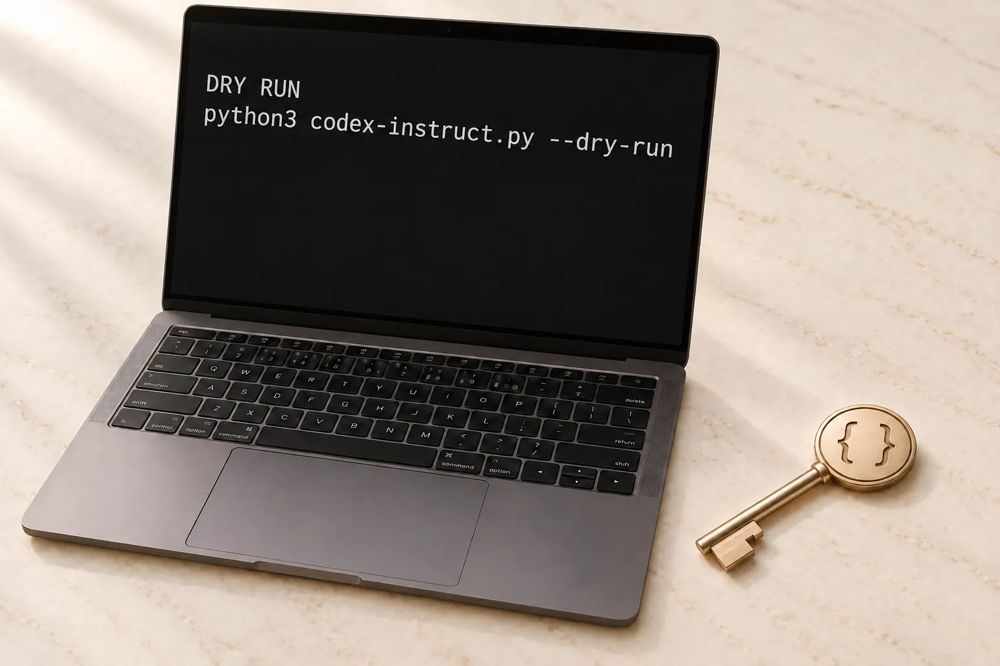

<!-- markdownlint-disable MD013 MD033 MD041 -->
<!-- WINDOWS_FRESH_DEPLOYMENT_POLICY: EXPLICIT_BETA -->

<div align="center">

<picture>
  <source media="(prefers-color-scheme: dark)" srcset="docs/assets/readme/codex-keysmith-hero-dark.webp" />
  <source media="(prefers-color-scheme: light)" srcset="docs/assets/readme/codex-keysmith-hero-light.webp" />
  
</picture>

<p>
  <a href="https://github.com/Jia-Ethan/codex-keysmith/actions/workflows/tests.yml"></a>
  <a href="https://github.com/Jia-Ethan/codex-keysmith/stargazers"></a>
  
  
  
</p>

<p>
  <a href="#简体中文">简体中文</a> ·
  <a href="README.en.md">English</a> ·
  <a href="docs/reference.md">使用说明</a> ·
  <a href="LICENSE">License</a>
</p>

<h1>codex-keysmith</h1>

<p>给 Codex 装上一份可撤销的指令。先看计划，确认了再写入。</p>

</div>

## 简体中文

Keysmith 给本机的 AI 编程工具装指令：先预览，再写入，能验证，能撤走。

`codex-keysmith` 面向 **Codex**。装上之后，新开的对话会按这份指令工作。不改 Codex 软件本身，也不读取账号和密钥。默认只装一份稿。

> [!IMPORTANT]
> 这会改变该 Codex 配置下 **之后新开的对话**。默认只给你看计划，加上确认才会写入。装完后请开一个新任务。

## 使用方式

<p align="center">
  <picture>
    <source media="(prefers-color-scheme: dark)" srcset="docs/assets/readme/project-architecture-zh-dark.webp" />
    <source media="(prefers-color-scheme: light)" srcset="docs/assets/readme/project-architecture-zh-light.webp" />
    
  </picture>
</p>

1. **先看计划。** 确认之前什么都不会写入。
2. **确认后装上。** 指令交给本机 Codex，软件保持原样。
3. **新开一轮对话。** 关掉旧任务，开一个新的。
4. **随时撤走。** 同样先看计划，确认后恢复成原来的样子。

<p align="center">
  <picture>
    <source media="(prefers-color-scheme: dark)" srcset="docs/assets/readme/codex-keysmith-preview-dark.webp" />
    <source media="(prefers-color-scheme: light)" srcset="docs/assets/readme/codex-keysmith-preview-light.webp" />
    
  </picture>
</p>

## 选哪个 Keysmith

| 你在用 | 用这个 | 怎么开始 |
| --- | --- | --- |
| **Codex** | **codex-keysmith** | 稳定版安装包 |
| [Claude Code](https://github.com/Jia-Ethan/claude-keysmith) | claude-keysmith | 源码 |
| [Grok Build](https://github.com/Jia-Ethan/grok-keysmith) | grok-keysmith | 稳定版安装包 |
| [ZCode](https://github.com/Jia-Ethan/zcode-keysmith) | zcode-keysmith | 源码 |

每个工具一份安装器。也有未签名桌面版（Apple Silicon / Windows x64）。

## 开始使用

本机需要已经装好 Codex。稳妥路径是 [最新稳定 Release](https://github.com/Jia-Ethan/codex-keysmith/releases/latest) 的单文件脚本（当前公开稳定脚本包括 `codex-instruct-v0.5.1.py`）。也有未签名桌面版。

```bash
# 把 vX.Y.Z 换成 Releases 页的最新稳定 tag
base='https://github.com/Jia-Ethan/codex-keysmith/releases/download/vX.Y.Z'
curl --fail --location --remote-name "$base/codex-instruct-vX.Y.Z.py"
curl --fail --location --remote-name "$base/SHA256SUMS"
awk '$2 == "codex-instruct-vX.Y.Z.py"' SHA256SUMS | shasum -a 256 -c -

python3 codex-instruct-vX.Y.Z.py --version
python3 codex-instruct-vX.Y.Z.py --codex-dir ~/.codex --status --lang zh-CN
python3 codex-instruct-vX.Y.Z.py --codex-dir ~/.codex --dry-run --lang zh-CN
# 确认目标目录、提示词来源和写入计划后：
python3 codex-instruct-vX.Y.Z.py --codex-dir ~/.codex --yes --lang zh-CN
```

源码路径：`git clone https://github.com/Jia-Ethan/codex-keysmith.git && cd codex-keysmith`，再把上述脚本名换成 `codex-instruct.py`。装完后关掉旧任务，开一个新 Codex 会话。Windows 把 `python3` 换成 `python`。也可以把 [代装说明](docs/agent-install.md) 交给你正在用的 AI 助手。细节见 [使用说明](docs/reference.md)。

## 怎么撤走

以下以 Release 单文件为例；源码 checkout 请把文件名换成 `codex-instruct.py`。

```bash
python3 codex-instruct-vX.Y.Z.py --codex-dir ~/.codex --restore-hooks --lang zh-CN
python3 codex-instruct-vX.Y.Z.py --codex-dir ~/.codex --uninstall --lang zh-CN
python3 codex-instruct-vX.Y.Z.py --codex-dir ~/.codex --uninstall --yes --lang zh-CN
```

`--reactivate` 从 `v0.3.9` 开始提供：

```bash
python3 codex-instruct-vX.Y.Z.py --codex-dir ~/.codex --reactivate
python3 codex-instruct-vX.Y.Z.py --codex-dir ~/.codex --reactivate --yes --lang zh-CN
```

先看计划，确认后再恢复。

## 适用环境

macOS 与 Linux 为主要支持。Windows 新鲜部署仍是测试通道。需要 Python 3.10+。本安装器不主动收集或上传用户数据。未签名桌面版会碰到 Gatekeeper / SmartScreen，不是 SignPath Foundation 签名；实体机验收见发布说明（physical-device acceptance）。

## 文档

- [使用说明](docs/reference.md)
- [代装说明](docs/agent-install.md)
- [安全说明](SECURITY.md)

## 系列

- [codex-keysmith](https://github.com/Jia-Ethan/codex-keysmith) — 给 Codex
- [claude-keysmith](https://github.com/Jia-Ethan/claude-keysmith) — 给 Claude Code
- [grok-keysmith](https://github.com/Jia-Ethan/grok-keysmith) — 给 Grok Build
- [zcode-keysmith](https://github.com/Jia-Ethan/zcode-keysmith) — 给 ZCode

官方反馈：[GitHub Discussions](https://github.com/Jia-Ethan/codex-keysmith/discussions) · 社区：[LINUX DO](https://linux.do)
