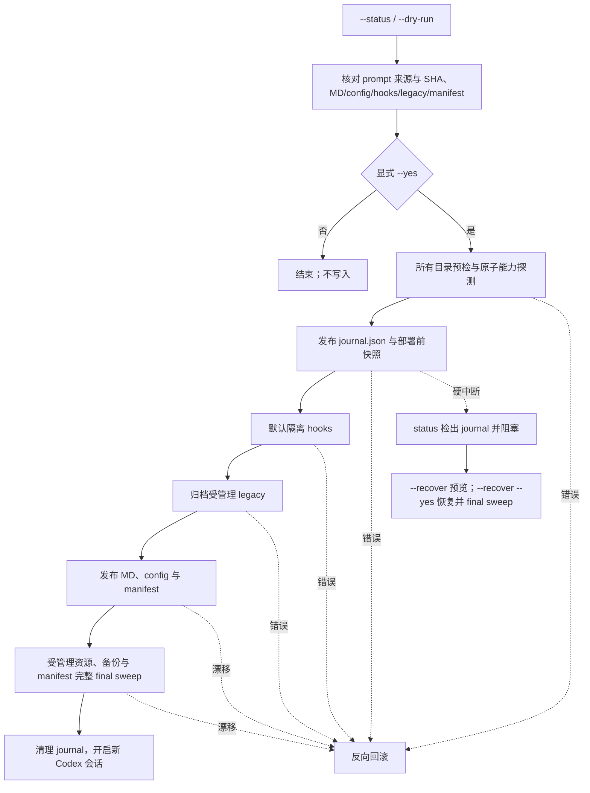

<!-- markdownlint-disable MD013 -->
<!-- WINDOWS_FRESH_DEPLOYMENT_POLICY: EXPLICIT_BETA -->

# 命令参考与内部机制 / Command reference and internals

本页面是完整的参数、状态字段、事务边界和维护者验证细节。日常使用只需要 [`README.md`](../README.md) 的「快速开始」；本页服务于需要理解恢复流程、卸载语义、或参与开发的人。

This page holds the complete option, status-field, transaction-boundary, and maintainer-verification detail. Everyday use only needs the Quick Start in [`README.md`](../README.md); this page is for anyone recovering a deployment, reasoning about uninstall semantics, or contributing. The bundled install prompt is overlay; see [`envelope.md`](envelope.md) only if you need append-not-replace.

---

## 简体中文

### 状态输出字段

```bash
python3 codex-instruct.py --codex-dir ~/.codex --status --lang zh-CN
```

```text
[状态] 找到 1 个 Codex 配置目录（只读检查）:

── 状态目录: <codex-dir> ──
    config.toml: regular file (<codex-dir>/config.toml)
    gpt-overlay.md: regular file (<codex-dir>/gpt-overlay.md)
    gpt5.5-unrestricted.md: missing (<codex-dir>/gpt5.5-unrestricted.md)
    hooks.json: missing (<codex-dir>/hooks.json)
    hooks.json.disabled: regular file (<codex-dir>/hooks.json.disabled)
    部署清单: regular file (<codex-dir>/.codex-keysmith-manifest.json)
    model_instructions_file: ./gpt-overlay.md
    preset: overlay
    配置激活状态: active（当前配置已加载受管提示词）
    事务残留: none
    旧版迁移: 无需处理
    hooks 恢复: 可执行 <restore-command>
    结构健康: healthy
    卸载就绪度: ready
    可部署性: ready
```

`--status` 不修改文件，也不读取或解析 active/disabled hooks 内容。它会读取 manifest 并验证其要求的恢复备份证据；必要时用 manifest 中的受管 MD 路径作为当前提示词节点。只读字段 `preset` 根据 manifest 记录判定为 `overlay`、`unrestricted`、`contract`、`persona-contract`、`lean`、`astra`、`custom` 或 `unknown`（无 manifest）。必要 hooks backup 或受管 MD 缺失、异常或漂移时，激活状态为 `conflict`，卸载就绪度和可部署性都为 `blocked`，返回 1。manifest 与受管 MD 完整，但当前 config 缺少顶层 `model_instructions_file` 时，状态为 `inactive-by-config`：status 返回 0、结构健康保持 `healthy`，可部署性 blocked。若只要把缺失字段补回当前 live config，使用 `--reactivate`（先备份 `config.toml`，不改写受管提示词、hooks 或 manifest）；完整部署仍须先切回引用受管 MD 的 active 配置。卸载就绪度为 `ready`：卸载保留当前 `config.toml`，只撤销提示词文件、受管理 hooks/legacy 和当前 manifest，不回写部署前备份。字段存在却指向其他路径仍是 `conflict` 并返回 1。status 还用目录枚举和 `lstat` 检出 `.codex-keysmith-transaction-<id>`、cleanup claim/marker 与 `.keysmith-*` 残留；status 不解析 `journal.json`，恢复内容只由显式 `--recover` 读取。

### 会修改哪些文件

| 路径 | 确认部署行为 |
| --- | --- |
| `<codex-dir>/<name>.md` | 新建；已有普通文件时先创建时间戳备份再替换 |
| `<codex-dir>/config.toml` | 仅在顶层值需要变化时备份并更新；值相同则保持原字节 |
| `<codex-dir>/hooks.json` | 默认先备份，再整体隔离为 `hooks.json.disabled` |
| `<codex-dir>/hooks.json.disabled` | 已存在时先移动到时间戳备份，再发布新的 disabled 文件 |
| `<codex-dir>/gpt5.5-unrestricted.md` | 被引用或匹配历史内置内容时事务归档；自定义孤立文件保留 |
| `<codex-dir>/.codex-keysmith-manifest.json` | 记录 MD/config、实际隔离的 hooks、实际归档的 legacy、备份与上一层 manifest |
| `<codex-dir>/.codex-keysmith-transaction-<id>/` | 保存 deploy/uninstall journal、固定名称 pending 文件、不可变 `intent.json` 和 before snapshots；deploy 另有 manifest companion，终态使用 `committed` / `recovered` 与可重入 cleanup marker 清理 |
| `<codex-dir>/.keysmith-*` | 单步骤临时目录；正常完成后清理，异常残留会阻止后续写入 |

受管理节点必须是普通文件。符号链接、悬空链接、目录、FIFO、socket 或无效 UTF-8 会 fail closed。config 的长期 manifest 所有权是语义化的顶层 `model_instructions_file`，不是整份 `config.toml`：只要当前值仍为 `./<manifest md.path>`，CCSwitch 等外部工具重写无关字段不会阻塞 status/uninstall；若本层部署曾修改该字段，卸载从已验证的整文件备份提取部署前语句并合并进当前 config（部署前无该语句则只删除当前语句），保留其他 live 内容；若本层 `config.changed=false`，卸载不写 config。目标字段缺失可被只读 status 识别为 `inactive-by-config`：deploy 仍保持 blocked；`--reactivate` 只在 manifest/MD 指纹匹配时把缺失的顶层字段补回当前 live config；卸载则保留当前 `config.toml` 并撤销其余受管层；指向其他路径、重复、歧义或扫描器不支持的语句结构仍会 fail closed。内置零依赖扫描器不声称完整验证无关 TOML 值语法或跨表键冲突。完整文件指纹继续用于预检读取、CAS、journal before snapshot、回滚、并发拒绝和崩溃恢复；合并后的 config 在 immutable uninstall intent 中固定唯一 SHA-256 after 状态。只有本次确实隔离的 hooks 和确实归档的 legacy 才进入 manifest 所有权；未隔离 hooks 与未受管理 legacy 不会被 uninstall 验证或改写。显式 `--skip-hooks-isolation` 时，hooks 节点完全排除在计划、manifest 和读写边界之外，但仍可能继续影响模型行为。

### CCSwitch 配置隔离状态机

CCSwitch 普通模式会在切走时把 live Codex config 回填到当前 Provider，再把目标 Provider 保存的完整 config 写入 live。由此可维护两个同源副本：On 副本含 `model_instructions_file = "./<manifest md.path>"`，Off 副本不含该顶层字段。Keysmith 的只读状态分类为：

| 状态 | 条件 | status | deploy / uninstall / reactivate |
| --- | --- | --- | --- |
| `active` | 字段精确引用当前 manifest-owned MD | 成功 | 按正常预检继续；`--reactivate` 为 no-op |
| `inactive-by-config` | manifest/MD 存在且完整，但字段缺失 | 成功并提示当前配置未加载提示词 | deploy blocked；uninstall 保留当前 config.toml；`--reactivate` 只补回缺失字段 |
| `conflict` | 字段改指其他路径，或目标语句重复/歧义/不支持 | 失败 | fail closed |
| `not-installed` | 无 manifest | 正常未安装状态 | 可部署；卸载 / `--reactivate` 为 no-op |

这不是 manifest profile schema，也不把任意缺字段写成持久化的“已授权暂停”；它只让 status 准确解释外部配置切换。deploy 仍 fail closed，直到切回引用受管 MD 的 On 副本，或对当前 live config 显式运行 `--reactivate`。在 Off 副本上卸载会保留当前 live `config.toml`，因此 On 副本里可能仍引用已删除的提示词文件，卸载后需在 On 副本中删除该字段。CCSwitch v3.18.0（`ff3bc242`）会在写入 Provider 前合并启用的 Codex 通用配置片段，因此该片段不得包含 `model_instructions_file`；否则 Off Provider 的有效 live config 仍会是 active。普通模式切离时，live config 读取失败可让 backfill 被跳过，数据库保存失败也只产生 warning，所以卸载后必须检查切换提示与 Provider 保存内容，不能把一次切换当成回填成功证明。该版本代理接管热切换也可能按目标 Provider 的有效配置重建 live config，但还涉及 restore backup、通用配置合并和代理字段覆盖，Keysmith 不将其视为稳定契约。默认 hook isolation 是 `.codex` 目录级全局状态，不会跟随 Provider config 切换；需要纯提示词 On/Off 时，在首次部署使用 `--skip-hooks-isolation`。任何切换只对新 Codex 会话生效。

### 内部工作流程



### 自定义指令与 CLI 语言

```bash
python3 codex-instruct.py \
  --file ./my-prompt.md \
  --name my-rules \
  --codex-dir ~/.codex \
  --dry-run \
  --lang zh-CN
```

确认后把 `--dry-run` 改为 `--yes`。外部 Markdown 必须是 no-follow 普通 UTF-8 文件。`--name` 只允许 ASCII 字母、数字、点、下划线和连字符，不接受路径分隔符、绝对路径、`..`、空格或空名称。`gpt5.5-unrestricted` 是旧版迁移保留名，不能作为自定义 `--name`。

`--lang auto|zh-CN|en` 控制 CLI 输出：

- `auto` 依次读取 `LC_ALL`、`LC_MESSAGES`、`LANG`；值以 `zh` 开头时使用简体中文，以 `en` 开头时使用英文；
- 其他已设置但不受支持的 locale 安全回退到 `zh-CN`；三项环境变量都缺失时，再读取系统 locale，识别 English/Chinese 名称，否则回退 `zh-CN`；
- `--lang zh-CN` / `--lang en` 明确覆盖自动选择；
- `--version` 输出当前脚本版本，不访问 Codex 配置。

### hooks 单独恢复

```bash
python3 codex-instruct.py --codex-dir ~/.codex --restore-hooks --lang zh-CN
```

恢复只处理 `hooks.json.disabled -> hooks.json`，不部署 MD、不编辑 config，也不读取 JSON：没有 disabled 文件是成功 no-op；active 与 disabled 同时存在时不覆盖任一方，返回 1；异常节点、事务残留或并发漂移返回 1 并保留证据；`--restore-hooks` 不接受 `--yes`、`--file`、`--name` 或 `--skip-hooks-isolation`。

### 中断事务恢复

`--recover` 处理 deploy 或 uninstall 在首次修改前创建的 `.codex-keysmith-transaction-<id>/journal.json` 和快照，并按不可变 `operation` 选择恢复算法：

```bash
python3 codex-instruct.py --codex-dir ~/.codex --recover --lang zh-CN        # 预览
python3 codex-instruct.py --codex-dir ~/.codex --recover --yes --lang zh-CN  # 确认
```

- 指定任一参与目录即可；日志会列出并验证同一 transaction ID 的全部参与目录；
- 预检交叉验证 journal、不可变 intent、owner、参与者、before snapshots，以及每个 live 资源当前是否属于记录的 before/after 状态；deploy 额外验证 manifest intent；
- 未知事务残留、外部篡改参与者、快照漂移或用户并发内容都会 fail closed，日志与证据原样保留；
- deploy 按反向参与目录和 `manifest -> config -> MD -> legacy -> disabled hooks -> active hooks` 恢复；uninstall 按反向参与目录恢复 manifest/archive、legacy、hooks、MD 和 config 的 before state；
- 全部资源、恢复出的上一层 manifest 所有权和 journal companion 完成最终 sweep 后，才按精确 residue 名称、目录 identity、成员集合与指纹清理；
- 成功部署先写入 `committed`，成功恢复先写入 `recovered` 并再做一次 final sweep；
- 同时发现多个 transaction ID 时不会猜测合并，应分别指定其参与目录恢复。

`--recover` 不等同于 `--restore-hooks` 或新的 `--uninstall`：recover 回到被中断的 deploy/uninstall 开始前，restore-hooks 只重新启用 disabled hooks，新的 uninstall 撤销已成功完成且有 manifest 的最新部署层。完整状态机见 [`hooks-transactions.md`](hooks-transactions.md)。

### 清单式分层卸载

```bash
python3 codex-instruct.py --codex-dir ~/.codex --uninstall --lang zh-CN        # 预览
python3 codex-instruct.py --codex-dir ~/.codex --uninstall --yes --lang zh-CN  # 卸载一层
```

卸载仅处理 `.codex-keysmith-manifest.json` 明确拥有的最新一层：

- 先验证当前 MD、config 顶层 `model_instructions_file` 语义所有权、实际隔离的 hooks、实际归档的 legacy、全部必要备份和 manifest 的预期存在状态；config 字节仍匹配 manifest after 时沿用普通路径，只有 mtime 改变但字节相同也可继续；`inactive-by-config` 允许卸载，但会保留当前 `config.toml`，不回写部署前备份；
- 任一路径漂移、备份缺失、manifest 无效或节点异常时，所有目录都在写入前停止；
- 首次修改前为全部参与目录发布 immutable durable intent、精确资源定义和 before snapshots；硬中断后由 `--recover` 反向恢复；
- 恢复该层部署前的 config 与 MD；`inactive-by-config` 时跳过 config 回写。仅当 manifest 记录了真实隔离/归档时，才恢复 hooks、旧 disabled hooks 或 legacy；
- 当前 manifest 原子归档为 `.codex-keysmith-manifest.json.uninstalled_<timestamp>`；
- 如果该层覆盖了上一份 manifest，则恢复上一层。再次运行 uninstall 才会继续撤销下一层；
- 找不到 manifest 是成功 no-op。v0.1.0 之前没有 manifest 的部署不属于自动所有权范围。

`--restore-hooks` 只恢复 hooks；`--uninstall` 按 manifest 恢复整层用户配置。`--reactivate` 只把缺失的顶层 `model_instructions_file` 补回当前 live `config.toml`。

### 从 inactive-by-config 恢复配置引用

```bash
python3 codex-instruct.py --codex-dir ~/.codex --reactivate --lang zh-CN        # 预览
python3 codex-instruct.py --codex-dir ~/.codex --reactivate --yes --lang zh-CN  # 只补回字段
```

仅在以下条件同时成立时写入：

- manifest 结构健康，受管 Markdown 的路径与 SHA-256（完整指纹）仍匹配；
- 当前 `config.toml` 可被零依赖扫描器解析，且顶层 `model_instructions_file` 缺失而不是指向其他路径；
- 没有事务残留或其他所有权冲突。

写入前先为全部参与目录备份当前 `config.toml`，再逐目录插入 manifest 期望的顶层字段，并在结束前复核全部参与目录。可捕获异常、`Ctrl-C` 或 `SystemExit` 会反序恢复本次已发布的目录；并发替换会被保留，原备份也会保留供人工核对。不改写 Markdown、hooks 或 manifest。字段已存在且指向受管文件时是成功 no-op。这不会把 CCSwitch Off 副本变成持久 On；它只修改当前 live config。

`--reactivate` 没有 deploy/uninstall 的 durable journal：`SIGKILL`、进程丢失或断电可能让部分目录已 active、其余仍 inactive，`--recover` 不处理该状态。没有冲突或异常残留时，重新运行 `--reactivate --yes` 会跳过已 active 目录并完成其余目录；否则保留时间戳备份，先用 `--status` 核对并人工恢复。

### 升级工具与回滚

1. 从新的固定 Release 下载新的独立脚本或 bundle，并用该 Release 的 `SHA256SUMS` 校验。
2. 保留旧脚本和旧 Release 资产，不覆盖式替换。
3. 运行新脚本的 `--version`、`--status`、`--dry-run`。
4. 确认后部署；新部署会生成新的 manifest 层。
5. 如需回退，先用新脚本执行一次 `--uninstall --yes` 撤销最新层；需要继续回退时逐层重复。hooks 只需单独恢复时使用 `--restore-hooks`。
6. 代码本身的版本回退是重新使用已校验的旧 Release 脚本；它不会自动改变用户配置。用户配置回退必须显式 uninstall/restore。

### 备份保留与安全清理

工具不会自动删除 `*.bak_*`、`*.recovery_*` 或 `.uninstalled_*`。durable journal 会在成功 deploy/uninstall、干净运行时回滚或成功 `--recover` 后清理；一旦恢复预检失败，它会与快照和未知残留一起保留，作为所有权、恢复和事故排查证据。

只有在以下条件全部满足后，才考虑清理：

1. `--status` 无阻塞，不存在 durable journal，且不再需要继续分层 uninstall；
2. 当前 `config.toml` 不引用准备移走的 MD/legacy 文件；
3. 当前 manifest 及所有更早 manifest 都不引用对应备份；
4. `hooks.json` / `hooks.json.disabled` 状态已人工确认；
5. 先复制整个 `.codex` 目录或把候选文件移动到仓库外的可恢复归档/系统废纸篓，再观察新的 Codex 会话。

不要直接删除当前 manifest、事务残留或无法确认所有权的备份。

### 旧文件名迁移

默认内置部署（目标名为 `gpt-overlay.md`）以及兼容稿 `gpt-unrestricted.md` 时，工具检查 `gpt5.5-unrestricted.md`。被 config 引用或匹配历史内置哈希的普通文件会事务归档；只有这种 `archive` 动作进入 manifest 所有权。未引用的自定义内容保留并标记为未受管理，manifest 不记录其指纹，uninstall 不检查或改写它。为避免与迁移路径冲突，`--name gpt5.5-unrestricted` 被保留并拒绝。

### 场景部署（v0.3 M1 / M2）

场景层与既有指令层完全正交：不读取或修改 `.codex-keysmith-manifest.json`、`config.toml`、`hooks.json` 或 `model_instructions_file`。所有场景写入只发生在显式目标的 `<target>/.codex-keysmith/`。M2 第一阶段在同一库中加入三个评测包，并运行只读 `requires` 探测。M2 第二阶段提供密封 `codex-keysmith-scenarios-v<VERSION>.bundle`。

```bash
python3 codex-instruct.py --scenario-list
python3 codex-instruct.py --deploy-scenario example_fixture --target-dir /absolute/project
python3 codex-instruct.py --deploy-scenario example_fixture --target-dir /absolute/project --yes
python3 codex-instruct.py --scenario-status --target-dir /absolute/project
python3 codex-instruct.py --scenario-uninstall DEPLOYMENT_ID --target-dir /absolute/project
python3 codex-instruct.py --scenario-uninstall DEPLOYMENT_ID --target-dir /absolute/project --yes
python3 codex-instruct.py --scenario-recover --target-dir /absolute/project
python3 codex-instruct.py --scenario-recover --target-dir /absolute/project --yes
```

- `--target-dir` 必须是存在、可枚举、解析后仍与输入一致的绝对目录；不会回退到 cwd。
- 源码运行默认从脚本同级 `scenarios/` 读取。`--scenario-root` 可以是源码 `scenarios/`、含 `index.json` + `scenarios/` 的解包目录，或密封 `codex-keysmith-scenarios-v<VERSION>.bundle`。打开 bundle 或带 index 的目录时先校验 index 与每个 M1 `source_digest`，任一成员漂移 fail closed。加载时会固定场景包目录身份并核验 `scenario.json` 与全部文件摘要；部署锁定同一目录、重新枚举完整包并在 staging 前、中、后复核身份，新增/删除成员、替换、路径重绑或 source/target 祖先关系重叠都会停止且不写 target。单文件 CLI 不内嵌场景库；冻结 sidecar 嵌入同版本 bundle，资源完好且摘要匹配时不必再传 `--scenario-root`，缺失或漂移则明确失败。不联网下载或猜测其他目录。
- 同一 `scenario_id` 可在同一或不同 target 重复部署；每次生成独立 32 位十六进制 `deployment_id`。status 和 uninstall 始终以 `deployment_id + target` 精确定位。
- target-local `scenario-manifest.json` 保存 target/control/scenarios/payload identity 和完整文件摘要；status 实时派生 `active` / `conflict`，不信任持久化状态标签。
- 可验证的中断 journal 报告 `recovery-required`；异常、篡改或证据身份不匹配（如 cleanup marker 与 journal 无法配对、journal 含未知成员）报告 `conflict` 并原样保留。pre-commit recover 回到事务前态；committed/recovered 及其 cleanup 证据中断（含 marker 已发布、journal 成员尚未清完）只完成前向证据清理，不回滚已提交结果。
- uninstall 先把完整 payload 原子 claim 到 journal，再提交移除 manifest entry；漂移、额外成员（包括运行生成的 `__pycache__`、`.pyc`、`.pyo`）、异常节点、路径重绑或并发重建都会停止，不删除用户节点。
- M1 自带无依赖 `example_fixture`。M2 第一阶段另有 `cyber_keystone`、`aiml_toxigen`、`chem_rdkit`：均声明 `darwin`/`linux`，`fixtures/` 不部署。`chem_rdkit` 的 `requires` 探测当前解释器中的 `rdkit>=2022.9`，失败时给出安装 blocker，从不自动安装。
- `verify.py` 用当前 Python 运行 validator 的正例、负例和篡改检测；部署后在临时目录创建验收输入，不依赖未部署的 `fixtures/`。validator 退出码分别为 `0`（完整）、`1`（拒绝话术或关键段缺失）、`2`（预期外漂移）。`--scenario-list` 不执行 validator/verify，但会运行受控、无 shell、有限超时的只读依赖探测。

完整 schema、事务 phase、M1/M2 边界见 [`v0.3-scenario-deployment-design.md`](v0.3-scenario-deployment-design.md)。

### 场景评估（v0.3 M3）

源码 ZIP / tar.gz 内的 `scripts/run_scenario_bank.py` 可读取源码 `scenarios/`、带 `index.json` 的解包目录或同版本密封 `.bundle`。它依赖同一源码树的 `codex-instruct.py`，不进入单文件 CLI 或当前 Desktop 安装包。

```bash
python3 scripts/run_scenario_bank.py --validate-only \
  --scenario-root /absolute/codex-keysmith-scenarios-vX.Y.Z.bundle

OPENAI_API_KEY=YOUR_KEY python3 scripts/run_scenario_bank.py \
  --scenario example_fixture --model MODEL --attempts 2 --timeout 600 \
  --report /absolute/reports/example-fixture.jsonl
```

- `--validate-only` 复用完整场景库、index、成员摘要和路径安全校验，并执行每个选中包的离线 `verify.py`；不调用 Codex。依赖或平台 blocker 会显示，但不把完整包误判为损坏。
- `verify.py` 与 `validator.py` 是本机执行代码；只使用同版本 Release bundle 或已审阅目录。无凭证最小环境不是操作系统级读取/网络沙箱，完整信任边界见 [`../SECURITY.md`](../SECURITY.md)。
- Live 模式要求 `--model` 与 `OPENAI_API_KEY`。`CODEX_API_KEY` 仅作为 runner 兼容别名映射到 `OPENAI_API_KEY`。可选 `OPENAI_BASE_URL` 必须是带非空 host 的绝对 `http://` 或 `https://` OpenAI 兼容根路径；userinfo、query 与 fragment 会被拒绝，scheme、host 与末尾斜杠会被规范化。runner 不读取 live `~/.codex/config.toml`，而是向隔离 `codex exec` 注入 `model_provider=custom`、`wire_api=responses`、`env_key=OPENAI_API_KEY` 和 `supports_websockets=false`。由于 live 模式忽略用户 provider 配置，只有 Azure 凭证的环境不受支持。默认运行当前平台和依赖已满足的包；显式选择受阻包时以退出码 `2` 停止。报告与抛出的 live-mode 错误会脱敏已识别凭证、原始 endpoint 和规范化 endpoint。
- 每次尝试使用 canonical 临时 target、隔离 `HOME` / `CODEX_HOME` 和只读已部署场景目录。部署完成后会从 target manifest 复核实际 `source_digest`、成员摘要和 payload；Codex 使用严格配置，模型工具的 shell 仅继承平台核心环境，并显式过滤 API 凭证、代理和模型服务地址。模型以 final response 返回单个 JSON 对象；runner 在沙箱外写入临时输出，再以 `python -I -B` 和无凭证最小环境运行 validator。Codex、部署、`verify.py` 或 validator 超时时，runner 会终止对应进程树。
- validator 退出码 `0` 记为通过，`1` / `2` 记为失败并按 `--attempts` 重试。基础设施或安全校验异常使用退出码 `2`；已完成但未通过的 bank 使用退出码 `1`。默认 blocker skip 会写入报告；后续 runner 异常会追加 `runner_error`，保留此前已完成记录。
- 报告记录场景 `source_digest`、bundle SHA-256（如适用）、模型、Codex 版本、超时、尝试序号、validator 退出码、耗时和脱敏结果。指定 `--report` 文件路径时，以私有权限写入临时文件后原子 no-replace 发布；已有路径、symlink 或非普通节点均拒绝，不提供覆盖选项。若最终路径发生并发冲突或发布失败，完整临时证据会保留在私有临时路径。省略 `--report` 或使用 `-` 时输出到 stdout。
- Live 评估会把临时场景任务和 fixture 数据发送到所选模型服务，可能产生费用。runner 不主动加载用户项目或 live `~/.codex/config.toml`；Codex `read-only` sandbox 阻止写入，但不声明对当前账户全部可读文件的强读取隔离。报告默认不进入仓库、README 或 Release 描述。

### 参数与退出码

| 参数 | 说明 |
| --- | --- |
| `--file`, `-f` | 外部 Markdown；省略时使用内置提示词。与 `--preset` 互斥 |
| `--name`, `-n` | 输出文件名，不含 `.md`；默认 `gpt-overlay` |
| `--preset` | 内置稿，默认 `overlay`。旧稿名仅兼容已有部署；不可与 `--file` 同时使用 |
| `--scaffold PACK` | 预览或物化一个 fixture 包到 `--workspace-root`；默认 `~/.codex-fixture-workspace/<pack>`。不写 `~/.codex` |
| `--scaffold-list` | 列出 `--pack-dir` 或脚本旁 `fixture_packs/` 中的包 |
| `--scaffold-uninstall PACK` | 预览或删除已物化的该包目录，不删其他包，不碰 `~/.codex` |
| `--workspace-root DIR` | fixture 工作区根目录；不能是 `~/.codex` 或位于 `.codex` 内 |
| `--pack-dir DIR` | fixture 包目录；省略时使用脚本旁 `fixture_packs/` |
| `--force` | 覆盖 registry 指纹不匹配的已存在包目录（先改名为 `*.bak_<timestamp>`） |
| `--dry-run` | 预览部署，不写文件 |
| `--yes` | 确认常规部署、重新激活、清单式卸载或中断恢复 |
| `--codex-dir` | 显式选择单个 `.codex`；省略后使用自动发现 |
| `--status` | 只读状态；不解析 hooks JSON |
| `--restore-hooks` | 只恢复 disabled hooks |
| `--uninstall` | 预览或撤销最新一层受管理部署 |
| `--reactivate` | 预览或补回 inactive-by-config 缺失的顶层配置引用 |
| `--recover` | 预览或恢复 durable journal 记录的中断 deploy/uninstall |
| `--skip-hooks-isolation` | 保持 hooks 活跃；必须显式指定 `--codex-dir` |
| `--scenario-list` | 列出场景 root 与平台/依赖探测结果；不执行 validator/verify |
| `--deploy-scenario ID` | 预览或部署一个场景；写入必须同时提供 `--yes` 与绝对 `--target-dir` |
| `--scenario-status` | 只读查看一个 target 的场景状态 |
| `--scenario-uninstall ID` | 预览或卸载一个精确 `deployment_id` |
| `--scenario-recover` | 预览或恢复一个 target-local 中断事务 |
| `--target-dir` | 场景操作的显式绝对目标；不影响 `--codex-dir` |
| `--scenario-root` | 显式绝对场景库（`scenarios/`、带 index 的解包目录或 `.bundle`）；仅 list/deploy 使用 |
| `--lang auto\|zh-CN\|en` | 自动或显式选择 CLI 输出语言 |
| `--version` | 显示脚本版本并退出 |

| 退出码 | 含义 |
| --- | --- |
| `0` | 成功部署、无阻塞预览/status、成功 restore/uninstall/recover，或正常 no-op |
| `1` | 所有权/完整性/节点/config 冲突、事务日志或残留、并发漂移、恢复或回滚失败 |
| `2` | argparse 参数错误、互斥模式或缺少参数约束 |

### 事务边界与已知限制

- 文件内容会 `fsync`，目标发布使用同卷原子无覆盖重命名，并在关键阶段复核完整指纹；
- 复制型备份通过集中式文件系统后端独占、no-follow 创建并持久化：POSIX 使用 `0600` 后再应用原文件权限；Windows 使用受保护 ACL，并以原生句柄复核稳定身份与完整指纹；
- 多目录 deploy/uninstall 先全部预检，再持久化私有 journal 目录、journal/intent JSON 和 before snapshots，之后才修改资源；
- 部署、`--recover` 和 uninstall 都在删除自身恢复证据前执行全部受管理参与目录的 final fingerprint sweep；
- `--reactivate` 也会在进程内完成全参与目录 final sweep，并对可捕获失败反序回滚，但不创建 durable journal；
- 不跟随 symlink，不使用完整 TOML 解析器；遇到歧义、重复目标键、占用命名空间或不安全语法时停止；
- `SIGKILL` 无法运行 Python 回滚；deploy/uninstall 首次修改前已完成持久化 journal，后续 status 会检出并 fail closed，等待显式 `--recover`。reactivate 不属于该恢复协议，硬中断后可能部分完成，应先 `--status`，无冲突时重跑以完成其余目录；
- macOS/Linux 使用 file/directory `fsync`；Windows P0 后端对受管理文件和目录句柄执行 `FlushFileBuffers`。Windows 逐 journal phase 的硬中断证据仍属 P1，因此该实现契约与 `EXPLICIT_BETA` fresh-deployment 策略都不等于正式支持；
- journal、intent、companion、manifest 与 cleanup claim 用于防止意外漂移和普通竞态，不是抵御同一账户协同篡改多份证据的密码学认证；
- `model_instructions_file` 对单份 live config 仍是全局项；CCSwitch 的 Provider 有效 config 可切换其存在状态，但通用配置合并可能重新注入它，Keysmith 不管理 CCSwitch 数据库、回填结果或代理接管热切换；hooks 只能整份隔离且不随 config 快照切换；
- 部署契约后，live config 里 `model_reasoning_effort = "max"` 会显著推高硬探测场景的拒绝率（v0.3.7 实测：同一最小化 CODEX_HOME，`max` 下 2/2 拒绝，`xhigh` 或删除该键 2/2 完整交付；AGENTS.md、memories、skills 经消融排除）。`max` 给了模型足够的自我审视预算推翻交付契约；建议部署契约的配置使用 `xhigh` 或更低。Keysmith 不改写该键，只记录这一实测结论；
- 内置提示词不保证任何模型或版本采用完全相同的行为。

完整状态机见 [`hooks-transactions.md`](hooks-transactions.md)。

### 可执行 Prompt Bank

```bash
python3 scripts/run_prompt_bank_regression.py --validate-only   # 离线，不调用模型

OPENAI_API_KEY=YOUR_KEY python3 scripts/run_prompt_bank_regression.py \
  --codex-bin codex --model MODEL --attempts 2 \
  --report work/prompt-bank.jsonl                                # live，需显式模型
```

当前 bank 最多 12 cases，每 case 最多 2 次尝试，即最多 24 次真实请求，超时上界约 48 分钟。Live 调用可能产生费用。已有报告默认拒绝覆盖，需要 `--overwrite-report` 才会替换。PR CI 只运行离线校验和 mocked adapter。

### 版本号同步

源码版本同时记录在 6 个文件里：`VERSION`、`codex-instruct.py` 的 `__version__`、`gui/package.json`、`gui/package-lock.json`（顶层与 root package 共 2 处）、`gui/src-tauri/Cargo.toml`、`gui/src-tauri/Cargo.lock`。`gui/src-tauri/tauri.conf.json` 不在内，它通过 `"version": "../package.json"` 继承，且校验器拒绝其他写法。

任意一处不一致都会让 Desktop Candidate 在版本校验步骤直接失败，构建不会开始。不要手工逐个编辑：

```bash
python3 scripts/bump_version.py check              # 汇报当前版本；不一致时 fail closed
python3 scripts/bump_version.py set 0.5.0 --dry-run
python3 scripts/bump_version.py set 0.5.0          # 一次性改全 6 处并自校验
```

`set` 在写入前要求当前树已经自洽，因此不会把一个已漂移的状态当作新基线；任何一步失败都会整体回滚，不留下混合版本的工作树。它只改版本字段，不重排 JSON、不触碰依赖锁定的其他条目，也不代替 CHANGELOG、`docs/releases/` 和 README 徒标的人工更新。

### 维护者验证

```bash
python3 -m py_compile codex-instruct.py scripts/build_release.py scripts/bump_version.py scripts/run_prompt_bank_regression.py scripts/run_scenario_bank.py
python3 scripts/bump_version.py check                 # 6 个来源文件版本必须一致
python3 scripts/validate_desktop_candidate.py config --root .
python3 -m pytest -p no:cacheprovider -q tests
python3 -m ruff check codex-instruct.py tests scripts
python3 -m coverage erase
python3 -m coverage run --branch --parallel-mode -m pytest -p no:cacheprovider -q tests
python3 -m coverage combine
python3 -m coverage report --include=codex-instruct.py,scripts/run_prompt_bank_regression.py --fail-under=81
python3 -m coverage report --include=scripts/run_scenario_bank.py --fail-under=65
python3 scripts/run_prompt_bank_regression.py --validate-only
python3 scripts/run_scenario_bank.py --validate-only
(
  cd gui
  npm ci
  npm test
  npm run build
  cargo fmt --manifest-path src-tauri/Cargo.toml -- --check
  cargo test --manifest-path src-tauri/Cargo.toml --locked
  cargo check --manifest-path src-tauri/Cargo.toml --locked
)

# pre-tag / PR / CI candidate：完整 checkout；既有版本冲突必须精确拒绝
RELEASE_TAG="v$(tr -d '\r\n' < VERSION)"
SOURCE_COMMIT="$(git rev-parse --verify 'HEAD^{commit}')"
python3 scripts/build_release.py "$RELEASE_TAG" --source-commit "$SOURCE_COMMIT" --output-dir dist-candidate
(cd dist-candidate && sha256sum --check SHA256SUMS)

# formal Release 仅在另行批准并创建不可变 tag 后执行；候选阶段不要运行
# python3 scripts/build_release.py "$RELEASE_TAG" --output-dir dist
# (cd dist && sha256sum --check SHA256SUMS)
git diff --check
```

候选构建只接受 40/64 位完整 commit object ID，要求 HEAD 精确匹配；如果 `v$VERSION` 已存在，它也必须指向该 commit。正式构建要求 annotated tag、VERSION、HEAD 和 peeled SHA 指向同一 commit，且要求干净工作树并拒绝覆盖不同内容的既有资产。当前测试集为 400+ 项，覆盖提示词一致性、CLI、目录发现、多目录 durable journal/recovery、权限、Unicode、symlink、hooks、TOML、manifest/uninstall、Prompt Bank、真实进程争用和 Release 资产可重复构建。

### 项目结构

```text
codex-keysmith/
├── .github/
│   ├── ISSUE_TEMPLATE/
│   ├── pull_request_template.md
│   └── workflows/
│       ├── desktop-candidate.yml
│       ├── release.yml
│       └── tests.yml
├── docs/
│   ├── agent-install.md
│   ├── envelope.md
│   ├── hooks-transactions.md
│   ├── reference.md
│   ├── legacy/
│   └── releases/
├── examples/gpt-overlay.md
├── examples/gpt-unrestricted.md
├── examples/gpt-contract.md
├── fixture_packs/
├── gui/
│   ├── src/
│   ├── src-tauri/
│   ├── README.md
│   ├── SPEC.md
│   ├── package.json
│   └── package-lock.json
├── scripts/
│   ├── build_release.py
│   ├── bump_version.py
│   └── run_prompt_bank_regression.py
├── tests/
├── CHANGELOG.md
├── CODE_SIGNING_POLICY.md
├── CONTRIBUTING.md
├── LICENSE
├── PRIVACY.md
├── README.en.md
├── README.md
├── SECURITY.md
├── VERSION
├── codex-instruct.py
├── pyproject.toml
└── requirements-quality.txt
```

---

## English

### Status output fields

```bash
python3 codex-instruct.py --codex-dir ~/.codex --status --lang en
```

`--status` changes no files and never reads or parses active/disabled hook content. It reads the manifest and verifies required restoration evidence, using the managed Markdown path from the manifest when present. The read-only `preset` field is `unrestricted`, `contract`, `persona-contract`, `lean`, `custom`, or `unknown` (no manifest), based on the managed Markdown SHA-256. Missing, abnormal, or drifted managed Markdown or required hook backups produce `conflict`, make uninstall readiness and deployability `blocked`, and exit 1. If the manifest and managed Markdown remain intact while the current config has no top-level `model_instructions_file`, status reports `inactive-by-config`: it exits 0 and keeps structural health `healthy`. Deploy stays blocked. Use `--reactivate` to restore only the missing top-level field into the current live config after a timestamped backup, without rewriting the managed prompt, hooks, or manifest. A full deploy still requires an active profile that references the managed Markdown. Uninstall readiness is `ready`: uninstall leaves the current `config.toml` unchanged and only reverts the managed prompt, managed hooks/legacy, and current manifest. A present field that targets another path remains a `conflict` and exits 1. Status also detects `.codex-keysmith-transaction-<id>`, cleanup claims/markers, and `.keysmith-*` residue through directory enumeration and `lstat`. Status never parses `journal.json`; only explicit `--recover` reads recovery content.

### Files changed by a confirmed deployment

| Path | Behavior |
| --- | --- |
| `<codex-dir>/<name>.md` | Create, or back up and replace an existing regular file |
| `<codex-dir>/config.toml` | Back up and update only when the top-level value changes; otherwise preserve bytes |
| `<codex-dir>/hooks.json` | Back up and isolate the whole active file as `hooks.json.disabled` by default |
| `<codex-dir>/hooks.json.disabled` | Back up an existing disabled file before publishing new disabled state |
| `<codex-dir>/gpt5.5-unrestricted.md` | Transactionally archive referenced/historical content; preserve unmanaged custom content |
| `<codex-dir>/.codex-keysmith-manifest.json` | Record MD/config, actually isolated hooks, actually archived legacy state, backups, and the previous manifest layer |
| `<codex-dir>/.codex-keysmith-transaction-<id>/` | Holds deploy/uninstall journals, fixed-name pending files, immutable `intent.json`, and before-state snapshots |
| `<codex-dir>/.keysmith-*` | Per-step temporary directories; normal completion removes them, and residue blocks later writes |

Managed targets must be regular files. Symlinks, dangling links, directories, FIFOs, sockets, and invalid UTF-8 fail closed. Long-lived config ownership is semantic ownership of the top-level `model_instructions_file`, not ownership of all `config.toml` bytes. CCSwitch-style rewrites of unrelated fields remain compatible while the field still equals `./<manifest md.path>`. If deployment changed that field, uninstall extracts the original statement from the verified full-file backup and merges only that statement into the live config (or removes it when originally absent), preserving all other live content; with `config.changed=false`, uninstall does not write config. Read-only status can classify a missing target field as `inactive-by-config`: deploy stays blocked; `--reactivate` restores only the missing top-level field when the manifest/Markdown fingerprints still match; uninstall leaves the current `config.toml` unchanged and reverts the remaining managed layer. A different target, duplicate or ambiguous target fields, unsupported statement structure, and abnormal nodes fail closed. The built-in zero-dependency scanner does not claim complete validation of unrelated TOML value syntax or cross-table key conflicts. Full-file fingerprints remain operation-time CAS, journal snapshot, rollback, concurrency, and crash-recovery evidence; a merged uninstall after-state is fixed by one SHA-256 in immutable intent. With `--skip-hooks-isolation`, hook paths are completely outside planning, manifest ownership, and the read/write boundary, but active hooks can continue to affect model behavior.

### CCSwitch profile-isolation state machine

In normal mode, CCSwitch backfills the live Codex config into the outgoing provider and writes the target provider's effective config to live. Two copies can therefore hold an On snapshot with `model_instructions_file = "./<manifest md.path>"` and an Off snapshot without that top-level field. Keysmith reports `active`, `inactive-by-config`, `conflict`, or `not-installed` using the same conditions documented in the Chinese table above. `inactive-by-config` is not a persistent manifest suspension grant: deploy remains fail closed until the On snapshot is selected again, or `--reactivate` restores the missing field into the current live config. Uninstall from an Off snapshot leaves the live `config.toml` unchanged, so the On copy may still reference the deleted Markdown and must be cleaned afterwards. In CCSwitch v3.18.0 (`ff3bc242`), an enabled Codex Common Config Snippet is merged before live write, so that snippet must not contain `model_instructions_file`; otherwise the effective Off profile remains active. Backfill can be skipped after a live-read failure or return only a warning after a database-save failure, so verify the stored provider after uninstall. Proxy-takeover hot switching in that version may also rebuild live config from the target provider's effective config, but restore backups, common-config merging, and proxy overrides make it an unsupported compatibility boundary. Whole-file hook isolation is directory-global and does not follow provider config switches; use `--skip-hooks-isolation` at deployment for prompt-only switching. Changes apply only to newly started Codex sessions.

### Custom prompt and CLI language

```bash
python3 codex-instruct.py --file ./my-prompt.md --name my-rules --codex-dir ~/.codex --dry-run --lang en
```

`--name` accepts only ASCII letters, digits, dots, underscores, and hyphens; separators, absolute paths, `..`, spaces, and empty names are rejected. `gpt5.5-unrestricted` is reserved for legacy migration.

`--lang auto|zh-CN|en` checks `LC_ALL`, `LC_MESSAGES`, then `LANG`; an explicit `--lang` overrides detection.

### Restore hooks

```bash
python3 codex-instruct.py --codex-dir ~/.codex --restore-hooks --lang en
```

Restore only performs `hooks.json.disabled -> hooks.json`. An absent disabled file is a successful no-op; active and disabled files together, abnormal nodes, or concurrent drift exit 1 and preserve evidence.

### Restore a missing config reference

```bash
python3 codex-instruct.py --codex-dir ~/.codex --reactivate --lang en        # preview
python3 codex-instruct.py --codex-dir ~/.codex --reactivate --yes --lang en  # restore the field only
```

`--reactivate` writes only when the manifest and managed Markdown fingerprints still match, the live `config.toml` can be scanned, and the top-level `model_instructions_file` is missing rather than pointing at another path. It backs up every participant before the first publish, inserts the manifest-owned field, performs a participant-wide final sweep, and leaves Markdown, hooks, and the manifest unchanged. Catchable failures, `Ctrl-C`, and `SystemExit` restore published participants in reverse order; concurrent replacements and their backups are preserved. An already-active config is a successful no-op.

Reactivation has no durable deploy/uninstall journal. `SIGKILL`, process loss, or power loss can leave some directories active and others inactive, and `--recover` does not process that state. If status shows no conflict or abnormal residue, rerunning `--reactivate --yes` skips active directories and forward-completes the rest; otherwise retain the timestamped backups for manual review.

### Recover an interrupted transaction

```bash
python3 codex-instruct.py --codex-dir ~/.codex --recover --lang en        # preview
python3 codex-instruct.py --codex-dir ~/.codex --recover --yes --lang en  # apply
```

Selecting any participant is sufficient; the journal lists and verifies every participant with the same transaction ID. Unknown transaction residue, a tampered external participant, snapshot drift, or concurrent user content fails closed and preserves all journal evidence. Full state machine: [`hooks-transactions.md`](hooks-transactions.md).

### Manifest-based layered uninstall

```bash
python3 codex-instruct.py --codex-dir ~/.codex --uninstall --lang en        # preview
python3 codex-instruct.py --codex-dir ~/.codex --uninstall --yes --lang en  # remove one layer
```

Uninstall only touches the newest layer owned by `.codex-keysmith-manifest.json`. Unrelated live `config.toml` rewrites are preserved when the top-level `model_instructions_file` still references the manifest-owned Markdown. `inactive-by-config` allows uninstall while leaving the current `config.toml` unchanged. `--reactivate` restores only the missing field. A different target reference, target-field ambiguity or unsupported statement structure, managed-resource drift, missing backups, invalid manifests, or abnormal nodes stops every selected directory before writes. An absent manifest is a successful no-op.

### Upgrade and rollback

1. Download the next fixed Release script or bundle and verify its `SHA256SUMS`.
2. Keep the old verified script and assets; do not overwrite them in place.
3. Run the new script's `--version`, `--status`, and `--dry-run`.
4. Confirm deployment; it creates a new manifest layer.
5. To roll back, run `--uninstall --yes` for the newest layer with the new script. Use `--restore-hooks` when only hooks need restoration.

### Scenario deployment (v0.3 M1 / M2)

Scenario deployment is independent from the instruction layer and writes only under an explicit target's `<target>/.codex-keysmith/`. Use `--scenario-list`, `--deploy-scenario ID`, `--scenario-status`, `--scenario-uninstall DEPLOYMENT_ID`, and `--scenario-recover`; every target operation requires an absolute `--target-dir`, and every write remains preview-first until `--yes` is present.

Source mode defaults to the repository `scenarios/` directory. `--scenario-root` may be that source tree, an unpacked directory with `index.json` + `scenarios/`, or the sealed `codex-keysmith-scenarios-v<VERSION>.bundle`. Opening a bundle or indexed directory validates the index and every M1 `source_digest` and fails closed on drift. Package loading pins the source-directory identity and validates `scenario.json` plus every deployed digest. Deployment locks and fully re-enumerates that same package, rechecks its identity before, during, and after staging, and rejects any source/target ancestor overlap; added/removed members, replacement, or path rebinding therefore stop before target writes. Deployed payload verification is strict and treats generated `__pycache__`, `.pyc`, and `.pyo` nodes as unowned drift. The standalone CLI does not embed the library. Frozen/sidecar builds embed the same-version bundle and skip `--scenario-root` when the resource is present and the digest matches; a missing or drifted embed fails closed instead of guessing from cwd or downloading content. The manifest binds target, control directory, payload parent, and each deployment root by identity and digest. Recoverable journals report `recovery-required`; invalid evidence reports `conflict`. Pre-commit recovery restores the before-state, while committed cleanup recovery preserves the committed result and only finishes evidence removal. The dependency-free `example_fixture` remains the M1 fixture. M2 phase 1 adds `cyber_keystone`, `aiml_toxigen`, and `chem_rdkit` (darwin/linux only). `--scenario-list` never executes validator/verify code, but it does run controlled, no-shell, timeout-bounded `requires` probes; `chem_rdkit` probes `rdkit>=2022.9` in the current interpreter and never installs packages.

Full schema and phase boundaries: [`v0.3-scenario-deployment-design.md`](v0.3-scenario-deployment-design.md).

### Scenario evaluation (v0.3 M3)

`scripts/run_scenario_bank.py` in the source ZIP/tar.gz accepts the source `scenarios/` tree, an unpacked indexed directory, or a same-version sealed `.bundle`. It requires the adjacent `codex-instruct.py` and is not included in the standalone CLI or current Desktop installers.

```bash
python3 scripts/run_scenario_bank.py --validate-only \
  --scenario-root /absolute/codex-keysmith-scenarios-vX.Y.Z.bundle

OPENAI_API_KEY=YOUR_KEY python3 scripts/run_scenario_bank.py \
  --scenario example_fixture --model MODEL --attempts 2 --timeout 600 \
  --report /absolute/reports/example-fixture.jsonl
```

- `--validate-only` reuses full library, index, member-digest, and path-safety validation and runs each selected package's offline `verify.py` without invoking Codex. Platform or dependency blockers are reported without treating a complete package as corrupt.
- `verify.py` and `validator.py` are host-executed code. Use only the same-version Release bundle or a reviewed directory. A credential-free minimal environment is not an operating-system read/network sandbox; see [`../SECURITY.md`](../SECURITY.md).
- Live mode requires `--model` and `OPENAI_API_KEY`. `CODEX_API_KEY` is accepted only as a runner compatibility alias and is mapped to `OPENAI_API_KEY`. Optional `OPENAI_BASE_URL` must be an absolute `http://` or `https://` OpenAI-compatible root with a non-empty host. Userinfo, query, and fragment components are rejected; the scheme/host and trailing slashes are canonicalized. The runner does not read live `~/.codex/config.toml` and instead injects `model_provider=custom`, `wire_api=responses`, `env_key=OPENAI_API_KEY`, and `supports_websockets=false` into isolated `codex exec`. Azure-only credentials are unsupported because live mode ignores user provider configuration. The default bank runs ready packages only; explicitly selected blocked packages stop with exit code `2`. Reports and raised live-mode failures redact recognized credentials plus the raw and canonical endpoint values.
- Every attempt uses a canonical temporary target, isolated `HOME` / `CODEX_HOME`, and the deployed scenario directory in read-only mode. After deployment, the runner rechecks the actual target manifest `source_digest`, member hashes, and payload. Codex runs with strict configuration; model-invoked shell commands inherit only the platform core environment and explicitly filter API credentials, proxies, and model-service endpoints. The model returns one JSON object as its final response; the runner writes it outside the sandbox and launches the validator with `python -I -B` and a credential-free minimal environment. If Codex, deployment, `verify.py`, or the validator times out, the runner terminates that process tree.
- Validator exit `0` passes; `1` / `2` fail and may retry up to `--attempts`. Infrastructure or safety-validation errors use runner exit `2`; a completed bank with one or more failed scenarios uses exit `1`. Default blocker skips are recorded, and a later runner failure appends `runner_error` while preserving completed records.
- Reports include the scenario `source_digest`, bundle SHA-256 when applicable, model, Codex version, timeout, attempt, validator exit, latency, and redacted output details. When `--report` names a file, a private temporary file is atomically published with no replacement; existing paths, symlinks, and non-regular nodes are rejected, and no overwrite option is exposed. If final publication is blocked by a race or filesystem error, the complete private temporary evidence is retained. Omitting `--report` or using `-` writes JSONL to stdout.
- Live evaluation sends the temporary scenario task and fixture data to the selected model service and may incur cost. The runner does not intentionally load user projects or live `~/.codex/config.toml`; Codex `read-only` prevents writes but is not claimed as strong read isolation from every file visible to the current account. Reports are not published automatically.

### Options and exit codes

| Option | Description |
| --- | --- |
| `--file`, `-f` | External Markdown; omit it for the bundled prompt. Conflicts with `--preset` |
| `--name`, `-n` | Destination name without `.md`; default `gpt-overlay` |
| `--preset` | Bundled prompt, default `overlay`. Older names remain valid for existing deployments. Conflicts with `--file` |
| `--scaffold PACK` | Preview or materialize one fixture pack under `--workspace-root` (default `~/.codex-fixture-workspace/<pack>`). Does not write `~/.codex` |
| `--scaffold-list` | List packs in `--pack-dir` or `fixture_packs/` next to the script |
| `--scaffold-uninstall PACK` | Preview or delete that materialized pack only; does not touch other packs or `~/.codex` |
| `--workspace-root DIR` | Fixture workspace root; cannot be `~/.codex` or inside a `.codex` directory |
| `--pack-dir DIR` | Fixture pack directory; defaults to `fixture_packs/` next to the script |
| `--force` | Replace a materialized pack whose registry fingerprint does not match (renames the old directory to `*.bak_<timestamp>` first) |
| `--dry-run` | Preview deployment without writes |
| `--yes` | Confirm deployment, reactivation, manifest-based uninstall, or interrupted-transaction recovery |
| `--codex-dir` | Explicitly select one `.codex`; omission uses discovery |
| `--status` | Read-only status; never parses hook JSON |
| `--restore-hooks` | Restore disabled hooks only |
| `--uninstall` | Preview or remove the newest managed layer |
| `--reactivate` | Preview or restore the missing inactive-by-config top-level reference |
| `--recover` | Preview or restore an interrupted deploy/uninstall |
| `--skip-hooks-isolation` | Keep hooks active; requires explicit `--codex-dir` |
| `--scenario-list` | List packages and platform/dependency probes without running validator/verify |
| `--deploy-scenario ID` | Preview or deploy a scenario to an absolute `--target-dir` |
| `--scenario-status` | Read one target's scenario state |
| `--scenario-uninstall ID` | Preview or remove one exact deployment ID |
| `--scenario-recover` | Preview or recover one target-local transaction |
| `--target-dir` | Explicit absolute scenario target; independent of `--codex-dir` |
| `--scenario-root` | Explicit absolute scenario library (`scenarios/`, indexed unpack, or `.bundle`) for list/deploy |
| `--lang auto\|zh-CN\|en` | Auto-detect or explicitly select CLI output language |
| `--version` | Print the script version and exit |

| Code | Meaning |
| --- | --- |
| `0` | Success, blocker-free preview/status, or normal no-op |
| `1` | Ownership/integrity/node/config conflict, journal/residue, drift, or recovery/rollback failure |
| `2` | argparse error, conflicting modes, or an unmet argument constraint |

### Transaction boundaries and known limits

- File content is `fsync`ed; publication uses same-volume atomic no-replace renames.
- Deploy, recovery, uninstall, and in-process reactivation perform a participant-wide final sweep.
- `SIGKILL` cannot run Python rollback. Deploy/uninstall prepare a durable journal before the first mutation, so later status fails closed until explicit `--recover`. Reactivation has no durable journal; a hard interruption may partially complete and must be checked with status before an idempotent forward-completing rerun.
- Windows P0 backend calls `FlushFileBuffers` on managed handles; the per-journal-phase hard-interruption matrix remains P1, so it is not a formal support claim.
- Journal, intent, companion, manifest, and cleanup-claim evidence is not cryptographic authentication against coordinated same-user tampering.
- `model_instructions_file` remains global within one live config. CCSwitch can switch its presence through effective provider configs, but Common Config merging can reintroduce it; Keysmith does not manage the CCSwitch database, backfill outcome, or proxy-takeover hot switching. Hook isolation is whole-file and does not follow those configs.
- After deploying the contract, `model_reasoning_effort = "max"` in the live config measurably raises refusals on hard-probe scenarios (v0.3.7 measurement: same minimal CODEX_HOME refused 2/2 at `max`, delivered fully 2/2 at `xhigh` and with the key removed; AGENTS.md, memories, and skills were ruled out by ablation). `max` reasoning gives the model enough self-reflection budget to override the delivery contract; prefer `xhigh` or lower on configs that deploy it. Keysmith never rewrites that key — this is a recorded measurement, not managed behavior.

Full state model: [`hooks-transactions.md`](hooks-transactions.md).

### Executable prompt bank

```bash
python3 scripts/run_prompt_bank_regression.py --validate-only            # offline
OPENAI_API_KEY=YOUR_KEY python3 scripts/run_prompt_bank_regression.py \
  --codex-bin codex --model MODEL --attempts 2 --report work/prompt-bank.jsonl  # live
```

At most 12 cases, 2 attempts each: 24 real requests, ~48-minute theoretical timeout ceiling. Existing reports are rejected by default; `--overwrite-report` is required to replace one. PR CI runs only offline validation and mocked adapter tests.

### Version synchronization

The source version lives in six files: `VERSION`, `__version__` in `codex-instruct.py`, `gui/package.json`, `gui/package-lock.json` (both the top level and the root package entry), `gui/src-tauri/Cargo.toml`, and `gui/src-tauri/Cargo.lock`. `gui/src-tauri/tauri.conf.json` is excluded because it inherits the version through `"version": "../package.json"`, and the validator rejects any other arrangement.

A single stale entry fails the Desktop Candidate version step before any build starts. Do not edit them by hand:

```bash
python3 scripts/bump_version.py check              # report the version; fail closed on disagreement
python3 scripts/bump_version.py set 0.5.0 --dry-run
python3 scripts/bump_version.py set 0.5.0          # rewrite all six in one verified step
```

`set` requires the tree to already agree, so a partial bump is never adopted as the new baseline. Any failure rolls the whole tree back instead of leaving mixed versions behind. It only rewrites version fields: JSON is not reordered, unrelated lock entries are untouched, and it does not replace the manual CHANGELOG, `docs/releases/`, or README badge updates.

### Maintainer verification

```bash
python3 -m py_compile codex-instruct.py scripts/build_release.py scripts/bump_version.py scripts/run_prompt_bank_regression.py scripts/run_scenario_bank.py
python3 scripts/bump_version.py check                 # all six version sources must agree
python3 scripts/validate_desktop_candidate.py config --root .
python3 -m pytest -p no:cacheprovider -q tests
python3 -m ruff check codex-instruct.py tests scripts
python3 -m coverage erase
python3 -m coverage run --branch --parallel-mode -m pytest -p no:cacheprovider -q tests
python3 -m coverage combine
python3 -m coverage report --include=codex-instruct.py,scripts/run_prompt_bank_regression.py --fail-under=81
python3 -m coverage report --include=scripts/run_scenario_bank.py --fail-under=65
python3 scripts/run_prompt_bank_regression.py --validate-only
python3 scripts/run_scenario_bank.py --validate-only
(
  cd gui
  npm ci
  npm test
  npm run build
  cargo fmt --manifest-path src-tauri/Cargo.toml -- --check
  cargo test --manifest-path src-tauri/Cargo.toml --locked
  cargo check --manifest-path src-tauri/Cargo.toml --locked
)

RELEASE_TAG="v$(tr -d '\r\n' < VERSION)"
SOURCE_COMMIT="$(git rev-parse --verify 'HEAD^{commit}')"
python3 scripts/build_release.py "$RELEASE_TAG" --source-commit "$SOURCE_COMMIT" --output-dir dist-candidate
(cd dist-candidate && sha256sum --check SHA256SUMS)
git diff --check
```

400+ tests cover prompt parity, CLI behavior, discovery, multi-directory durable journal/recovery, permissions, Unicode, symlinks, hooks, TOML, manifest/uninstall, prompt-bank adapters, real-process contention, and reproducible release assets.

### Project layout

```text
codex-keysmith/
├── .github/                  # issue/PR templates and Tests/Release/Desktop workflows
├── docs/                     # reference, transaction design, install guide, release notes
├── examples/gpt-overlay.md
├── examples/gpt-unrestricted.md
├── examples/gpt-contract.md
├── fixture_packs/
├── gui/                      # React/Tauri desktop client, tests, and native bundle config
├── scripts/
├── tests/
├── CHANGELOG.md
├── CODE_SIGNING_POLICY.md
├── CONTRIBUTING.md
├── LICENSE
├── PRIVACY.md
├── README.en.md
├── README.md
├── SECURITY.md
├── VERSION
├── codex-instruct.py
├── pyproject.toml
└── requirements-quality.txt
```
