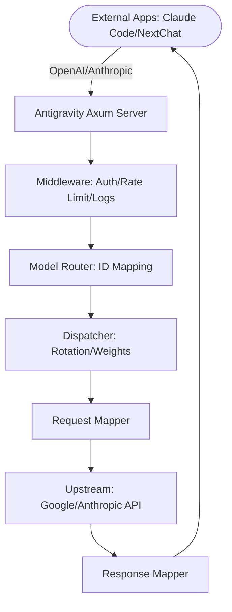

# Antigravity Tools 🚀
> Professional AI Account Management & Protocol Proxy System (v4.7.4)

<div align="center">
  

  <h3>Your Personal High-Performance AI Gateway</h3>
  <p>Not just account management, but the ultimate solution to break API barriers.</p>
  
  <p>
    <a href="https://github.com/lbjlaq/Antigravity-Manager">
      
    </a>
    
    
    
    
  </p>

  <p>
    <a href="#-features">Features</a> • 
    <a href="#-gui-overview">GUI Overview</a> • 
    <a href="#-architecture">Architecture</a> • 
    <a href="#-installation">Installation</a> • 
    <a href="#-quick-integration">Integration</a>
  </p>

  <p>
    <a href="./README.md">简体中文</a> | 
    <strong>English</strong>
  </p>
</div>

---

**Antigravity Tools** is an all-in-one desktop application designed for developers and AI enthusiasts. It perfectly combines multi-account management, protocol conversion, and smart request scheduling to provide you with a stable, high-speed, and low-cost **Local AI Relay Station**.

By leveraging this app, you can transform common Web Sessions (Google/Anthropic) into standardized API interfaces, completely eliminating the protocol gap between different providers.

## 💖 Sponsors

| Sponsor | Description |
| :---: | :--- |
|  | Thanks to **PackyCode** for sponsoring this project! PackyCode is a reliable and efficient API relay service provider, offering relays for various services such as Claude Code, Codex, and Gemini. PackyCode provides a special offer for users of this project: Register using [this link](https://www.packyapi.com/register?aff=Ctrler) and enter the **"Ctrler"** coupon code when topping up to enjoy a **10% discount**. |
|  | Thanks to **APIKEY.FUN** for sponsoring this project! APIKEY.FUN is a professional enterprise-grade AI relay station, dedicated to providing stable, efficient, and low-cost AI model API access services for enterprise and individual developers. The platform supports mainstream popular models such as Claude, OpenAI, and Gemini, with prices as low as 7% of the official original price. Register through [this exclusive link](https://apikey.fan/register?aff=Ctrler) for this project to enjoy an exclusive offer of up to **permanent 5% off on top-ups**. |
|  | Thanks to **Claude API** for supporting this project! claudeapi.com is a **Claude API** relay station built on **official and AWS channels**, focused exclusively on Claude, delivering high stability and low latency with full support for Claude Code. Exclusive offer: register via this [exclusive link](https://console.claudeapi.com/register?source=antigravity) to get **free trial credits — zero setup, get started instantly**; enjoy an extra **5% off** when you top up（Contact Support). |
|  | Thanks to **AICodeMirror** for sponsoring this project! AICodeMirror provides official high-stability relay services for Claude Code / Codex / Gemini CLI, supporting enterprise-grade concurrency, fast invoicing, and 24/7 dedicated technical support. Claude Code / Codex / Gemini official channels at 38% / 2% / 9% of original price, with extra discounts on top-ups! AICodeMirror offers special benefits for Antigravity-Manager users: register via [this link](https://aicodemirror.ai/register?invitecode=MV5XUM) to enjoy 20% off your first top-up, and enterprise customers can get up to 25% off! |


### ☕ Support

If you find this project helpful, feel free to buy me a coffee!

<a href="https://www.buymeacoffee.com/Ctrler" target="_blank"></a>

| Alipay | WeChat Pay | Buy Me a Coffee |
| :---: | :---: | :---: |
|  |  |  |

## 🚀 Recommended Projects

If you like this project, you might also be interested in:

*   **[Antigravity-Tools-LS](https://github.com/lbjlaq/Antigravity-Tools-LS)**: A Language Server Protocol (LSP) designed for AI protocols, providing you with smarter code completion, diagnostics, and protocol debugging experiences.

## 🌟 Detailed Feature Matrix

### 1. 🎛️ Smart Account Dashboard
*   **Global Real-time Monitoring**: Instant insight into the health of all accounts, including average remaining quotas for Gemini Pro, Gemini Flash, Claude, and Gemini Image generation.
*   **Smart Recommendation**: The system uses a real-time algorithm to filter and recommend the "Best Account" based on quota redundancy, supporting **one-click switching**.
*   **Active Account Snapshot**: Visually displays the specific quota percentage and the last synchronization time of the currently active account.

### 2. 🔐 Professional AI Account Management & Proxy System
*   **OAuth 2.0 Authorization (Auto/Manual)**: Pre-generates a copyable authorization URL so you can finish auth in any browser; after the callback, the app auto-completes and saves the account (use “I already authorized, continue” if needed).
*   **Multi-dimensional Import**: Supports single token entry, JSON batch import, and automatic hot migration from V1 legacy databases.
*   **Gateway-level Views**: Supports switching between "List" and "Grid" views. Provides 403 Forbidden detection, automatically marking and skipping accounts with permission anomalies.

### 3.  Protocol Conversion & Relay (API Proxy)
*   **Multi-Protocol Adaptation (Multi-Sink)**:
    *   **OpenAI Format**: Provides `/v1/chat/completions` endpoint, compatible with 99% of existing AI apps.
    *   **Anthropic Format**: Provides native `/v1/messages` interface, supporting all features of **Claude Code CLI** (e.g., chain-of-thought, system prompts).
    *   **Gemini Format**: Supports direct calls from official Google AI SDKs.
*   **Smart Self-healing**: When a request encounters `429 (Too Many Requests)` or `401 (Expired)`, the backend triggers **millisecond-level automatic retry and silent rotation**, ensuring business continuity.

### 4. 🔀 Model Router Center
*   **Series-based Mapping**: Classify complex original model IDs into "Series Groups" (e.g., routing all GPT-4 requests uniformly to `gemini-3-pro-high`).
*   **Expert Redirection**: Supports custom regex-level model mapping for precise control over every request's landing model.
*   **Tiered Routing [New]**: Automatically prioritizes models based on account tiers (Ultra/Pro/Free) and reset frequencies to ensure stability for high-volume users.
*   **Silent Background Downgrading [New]**: Intelligently identifies background tasks (e.g., Claude CLI title generation) and reroutes them to Flash models to preserve premium quota.

### 5. 🎨 Multimodal & Imagen 3 Support
*   **Advanced Image Control**: Supports precise control over image generation tasks via OpenAI `size` (e.g., `1024x1024`, `16:9`) parameters or model name suffixes.
*   **Enhanced Payload Support**: The backend supports payloads up to **100MB** (configurable), more than enough for 4K HD image recognition and processing.

##  GUI Overview

| | |
| :---: | :---: |
|  <br> Dashboard |  <br> Account List |
|  <br> About Page |  <br> API Proxy |
|  <br> Settings | |

### 💡 Usage Examples

| | |
| :---: | :---: |
|  <br> Claude Code Web Search |  <br> Cherry Studio Integration |
|  <br> Imagen 3 Advanced Drawing |  <br> Kilo Code Integration |

## 🏗️ Architecture



## 📥 Installation

### Option A: Terminal Installation (Recommended)

#### Cross-Platform One-Line Install Scripts

Automatically detects your OS, architecture, and package manager — one command to download and install.

**Linux / macOS:**
```bash
curl -fsSL https://raw.githubusercontent.com/lbjlaq/Antigravity-Manager/main/install.sh | bash
```

**Windows (PowerShell):**
```powershell
irm https://raw.githubusercontent.com/lbjlaq/Antigravity-Manager/main/install.ps1 | iex
```

> **Supported formats**: Linux (`.deb` / `.rpm` / `.AppImage`) | macOS (`.dmg`) | Windows (NSIS `.exe`)
>
> **Advanced usage**: Install a specific version `curl -fsSL https://raw.githubusercontent.com/lbjlaq/Antigravity-Manager/main/install.sh | bash -s -- --version 4.6.8`, dry-run mode `curl -fsSL https://raw.githubusercontent.com/lbjlaq/Antigravity-Manager/main/install.sh | bash -s -- --dry-run`

#### macOS - Homebrew
If you have [Homebrew](https://brew.sh/) installed, you can also install via:

```bash
# 1. Tap the repository
brew tap lbjlaq/antigravity-manager https://github.com/lbjlaq/Antigravity-Manager

# 2. Install the app
brew install --cask antigravity-tools
```

#### Arch Linux
You can choose to install via the one-click script or Homebrew:

**Option 1: One-click script (Recommended)**
```bash
curl -sSL https://raw.githubusercontent.com/lbjlaq/Antigravity-Manager/main/deploy/arch/install.sh | bash
```

**Option 2: via Homebrew** (If you have [Linuxbrew](https://sh.brew.sh/) installed)
```bash
brew tap lbjlaq/antigravity-manager https://github.com/lbjlaq/Antigravity-Manager
brew install --cask antigravity-tools
```

#### Other Linux Distributions
The AppImage will be automatically symlinked to your binary path with executable permissions.

### Option B: Manual Download
Download from [GitHub Releases](https://github.com/lbjlaq/Antigravity-Manager/releases):
*   **macOS**: `.dmg` (Universal, Apple Silicon & Intel)
*   **Windows**: `.msi` or portable `.zip`
*   **Linux**: `.deb` or `AppImage`

### Option C: Docker Deployment (Recommended for NAS/Servers)
If you prefer running in a containerized environment, we provide a native Docker image. This image supports the v4.0.3 Native Headless architecture, automatically hosts frontend static resources, and allows for direct browser-based management.

```bash
# Option 1: Direct Run (Recommended)
# - API_KEY: Required. Used for AI request authentication.
# - WEB_PASSWORD: Optional. Used for Web UI login. Defaults to API_KEY if NOT set.
docker run -d --name antigravity-manager \
  -p 8045:8045 \
  -e API_KEY=sk-your-api-key \
  -e WEB_PASSWORD=your-login-password \
  -e ABV_MAX_BODY_SIZE=104857600 \
  -v ~/.antigravity_tools:/root/.antigravity_tools \
  lbjlaq/antigravity-manager:latest

# Forgot keys? Run `docker logs antigravity-manager` or `grep -E '"api_key"|"admin_password"' ~/.antigravity_tools/gui_config.json`

#### 🔐 Authentication Scenarios
*   **Scenario A: Only `API_KEY` is set**
    - **Web Login**: Use `API_KEY` to access the dashboard.
    - **API Calls**: Use `API_KEY` for AI request authentication.
*   **Scenario B: Both `API_KEY` and `WEB_PASSWORD` are set (Recommended)**
    - **Web Login**: **Must** use `WEB_PASSWORD`. Using API Key will be rejected (more secure).
    - **API Calls**: Continue to use `API_KEY`. This allows you to share the API Key with team members while keeping the password for administrative access only.

#### 🆙 Upgrade Guide for Older Versions
If you are upgrading from v4.0.1 or earlier, your installation won't have a `WEB_PASSWORD` set by default. You can add one using any of these methods:
1.  **Web UI (Recommended)**: Log in using your existing `API_KEY`, go to the **API Proxy Settings** page, find the **Web UI Management Password** section below the API Key, set your new password, and save.
2.  **Environment Variable (Docker)**: Stop the old container and start the new one with the added parameter `-e WEB_PASSWORD=your_new_password`. **Note: Environment variables have the highest priority and will override any changes in the UI.**
3.  **Config File (Persistent)**: Directly edit `~/.antigravity_tools/gui_config.json` and add/modify `"admin_password": "your_new_password"` inside the `proxy` object.
    - *Note: `WEB_PASSWORD` is the environment variable name, while `admin_password` is the JSON key in the config file.*

> [!TIP]
> **Priority Logic**:
> - **Environment Variable** (`WEB_PASSWORD`) has the highest priority. If set, the application will always use it and ignore values in the configuration file.
> - **Configuration File** (`gui_config.json`) is used for persistent storage. When you change the password via Web UI and save, it is written here.
> - **Fallback**: If neither is set, it falls back to `API_KEY`; if even `API_KEY` is missing, a random one is generated.

# Option 2: Use Docker Compose
# 1. Enter the Docker directory
cd docker
# 2. Start the service
docker compose up -d
```
> **Log rotation**: Compose limits JSON logs to `100m` per file and keeps `3` files by default to prevent unbounded growth.
> **Access URL**: `http://localhost:8045` (Admin Console) | `http://localhost:8045/v1` (API Base)
> **System Requirements**:
> - **RAM**: **1GB** recommended (minimum 256MB).
> - **Persistence**: Mount `/root/.antigravity_tools` to persist your data.
> - **Architecture**: Supports x86_64 and ARM64.
> **See**: [Docker Deployment Guide (docker)](./docker/README.md)

<details>
<summary><b>🛠️ Troubleshooting - Click to expand</b></summary>

#### macOS says "App is damaged"?
Due to macOS security gatekeeper, non-App Store apps might show this. Run this in Terminal to fix:
```bash
sudo xattr -rd com.apple.quarantine "/Applications/Antigravity Tools.app"
```

#### Linux window is black or empty?
On niri, Hyprland, Sway, and similar compositors, older builds forced `GDK_BACKEND=x11` whenever `DISPLAY` was set, and WebKit then drew a black window. Update to a build that includes this fix, or launch once with:

```bash
env WEBKIT_DISABLE_DMABUF_RENDERER=1 ANTIGRAVITY_FORCE_WAYLAND=1 antigravity-tools
```

- `ANTIGRAVITY_FORCE_WAYLAND=1`: keep native Wayland (do not force X11)
- `ANTIGRAVITY_FORCE_X11=1`: force X11 if you still need it
- `WEBKIT_DISABLE_DMABUF_RENDERER=1`: disable the WebKit DMA-BUF renderer

</details>

## 🔌 Quick Integration Examples

### 🔐 OAuth Authorization Flow (Add Account)
1. Go to `Accounts` → `Add Account` → `OAuth`.
2. The dialog pre-generates an authorization URL before you click any button. Click the URL to copy it to the system clipboard, then open it in the browser you prefer and complete authorization.
3. After consent, the browser opens a local callback page and shows “✅ Authorized successfully!”.
4. The app automatically continues the flow and saves the account; if it doesn’t, click “I already authorized, continue” to finish manually.

> Note: the auth URL contains a one-time local callback port. Always use the latest URL shown in the dialog. If the app isn’t running or the dialog is closed during auth, the browser may show `localhost refused connection`.

### How to use with Claude Code CLI?
1. Start Antigravity service in the "API Proxy" tab.
2. In your terminal:
```bash
export ANTHROPIC_API_KEY="sk-antigravity"
export ANTHROPIC_BASE_URL="http://127.0.0.1:8045"
claude
```

### How to use with OpenCode?
1. Go to **API Proxy** → **External Providers** → click the **OpenCode Sync** card.
2. Click **Sync** to generate `~/.config/opencode/opencode.json`:
    - Creates a dedicated provider `antigravity-manager` (does not overwrite google/anthropic providers)
    - Optional: Check **Sync accounts** to export `antigravity-accounts.json` (plugin-compatible v3 format) for the OpenCode plugin
3. Click **Clear Config** to remove Manager configuration and clean up legacy entries; click **Restore** to revert from backup.
4. On Windows, the path is `C:\Users\<User>\.config\opencode\` (same `~/.config/opencode` rule).

**Quick verification commands:**
```bash
# Test antigravity-manager provider (supports --variant)
opencode run "test" --model antigravity-manager/claude-sonnet-4-5-thinking --variant high

# If opencode-antigravity-auth is installed, verify google provider still works independently
opencode run "test" --model google/antigravity-claude-sonnet-4-5-thinking --variant max
```

### How to use in Python?
```python
import openai

client = openai.OpenAI(
    api_key="sk-antigravity",
    base_url="http://127.0.0.1:8045/v1"
)

response = client.chat.completions.create(
    model="gemini-3-flash",
    messages=[{"role": "user", "content": "Hello, please introduce yourself"}]
)
print(response.choices[0].message.content)
```

### How to use with Kilo Code?
1.  **Protocol Selection**: We recommend using the **Gemini protocol**.
2.  **Base URL**: Set it to `http://127.0.0.1:8045`.
3.  **Note**: 
    - **OpenAI Protocol Limitation**: When using OpenAI mode, Kilo Code's request path will append `/v1/chat/completions/responses`, a non-standard path that will return 404 from Antigravity. Make sure to enter the Base URL and select Gemini mode.
    - **Model Mapping**: Model names in Kilo Code may differ from Antigravity's defaults. If you encounter connection issues, set up custom mappings on the "Model Mapping" page and check the **log files** for debugging.

### How to use Image Generation (Imagen 3)?

#### Method 1: OpenAI Images API (Recommended)
```python
import openai

client = openai.OpenAI(
    api_key="***",
    base_url="http://127.0.0.1:8045/v1"
)

# Generate image
response = client.images.generate(
    model="gemini-3-pro-image",
    prompt="A futuristic cyberpunk city with neon lights",
    size="1920x1080",      # Supports any WIDTHxHEIGHT format, auto-calculates aspect ratio
    quality="hd",          # "standard" | "hd" | "medium"
    n=1,
    response_format="b64_json"
)

# Save image
import base64
image_data = base64.b64decode(response.data[0].b64_json)
with open("output.png", "wb") as f:
    f.write(image_data)
```

**Supported parameters**：
- **`size`**: Any `WIDTHxHEIGHT` format (e.g. `1280x720`, `1024x1024`, `1920x1080`), auto-calculates and maps to standard aspect ratios (21:9, 16:9, 9:16, 4:3, 3:4, 1:1)
- **`quality`**: 
  - `"hd"` → 4K resolution (high quality)
  - `"medium"` → 2K resolution (medium quality)
  - `"standard"` → Default resolution (standard quality)
- **`n`**: Number of images to generate (1-10)
- **`response_format`**: `"b64_json"` or `"url"` (Data URI)

<details>
<summary><b>🎨 Expand to view more image generation methods & parameter mapping rules (Chat API / Model Suffix / Cherry Studio)</b></summary>

#### Method 2: Chat API + Parameters (✨ New)

**All protocols** (OpenAI, Claude) Chat APIs now support direct `size` and `quality` parameters:

```python
# OpenAI Chat API
response = client.chat.completions.create(
    model="gemini-3-pro-image",
    size="1920x1080",      # ✅ Supports any WIDTHxHEIGHT format
    quality="hd",          # ✅ "standard" | "hd" | "medium"
    messages=[{"role": "user", "content": "A futuristic city"}]
)
```

```bash
# Claude Messages API
curl -X POST http://127.0.0.1:8045/v1/messages \
  -H "Content-Type: application/json" \
  -H "x-api-key: ***" \
  -d '{
    "model": "gemini-3-pro-image",
    "size": "1280x720",
    "quality": "hd",
    "messages": [{"role": "user", "content": "A cute cat"}]
  }'
```

**Parameter priority**: `imageSize` parameter > `quality` parameter > model suffix

**✨ New `imageSize` parameter support**:

In addition to the `quality` parameter, you can now also use Gemini's native `imageSize` parameter:

```python
# Using imageSize parameter (highest priority)
response = client.chat.completions.create(
    model="gemini-3-pro-image",
    size="16:9",           # Aspect ratio
    imageSize="4K",        # ✨ Direct resolution: "1K" | "2K" | "4K"
    messages=[{"role": "user", "content": "A futuristic city"}]
)
```

```bash
# Claude Messages API also supports imageSize
curl -X POST http://127.0.0.1:8045/v1/messages \
  -H "Content-Type: application/json" \
  -H "x-api-key: ***" \
  -d '{
    "model": "gemini-3-pro-image",
    "size": "1280x720",
    "imageSize": "4K",
    "messages": [{"role": "user", "content": "A cute cat"}]
  }'
```

**Parameter descriptions**:
- **`imageSize`**: Direct resolution specification (`"1K"` / `"2K"` / `"4K"`)
- **`quality`**: Infers resolution from quality level (`"standard"` → 1K, `"medium"` → 2K, `"hd"` → 4K)
- **Priority**: If both `imageSize` and `quality` are specified, the system prioritizes `imageSize`

#### Method 3: Chat API + Model Suffix
```python
response = client.chat.completions.create(
    model="gemini-3-pro-image-16-9-4k",  # Format: gemini-3-pro-image-[ratio]-[quality]
    messages=[{"role": "user", "content": "A futuristic city"}]
)
```

**Model suffix explanation**：
- **Aspect ratio**: `-16-9`, `-9-16`, `-4-3`, `-3-4`, `-21-9`, `-1-1`
- **Quality**: `-4k` (4K), `-2k` (2K), no suffix (standard)
- **Example**: `gemini-3-pro-image-16-9-4k` → 16:9 ratio + 4K resolution

#### Method 4: Cherry Studio & Other Client Settings
In clients that support OpenAI protocol (e.g., Cherry Studio), you can configure image generation parameters via the **Model Settings** page:

1. **Enter Model Settings**: Select the `gemini-3-pro-image` model
2. **Configure Parameters**:
   - **Size**: Enter any `WIDTHxHEIGHT` format (e.g. `1920x1080`, `1024x1024`)
   - **Quality**: Choose `standard` / `hd` / `medium`
   - **Number**: Set the number of images (1-10)
3. **Send Request**: Simply type your image description in the chat dialog

**Parameter mapping rules**:
- `size: "1920x1080"` → Auto-calculated as `16:9` aspect ratio
- `quality: "hd"` → Mapped to `4K` resolution
- `quality: "medium"` → Mapped to `2K` resolution

</details>

## 📝 Changelog

> Latest version **v4.7.4** (2026-09-17): Unified Pipeline processing engine across OpenAI Chat/Responses, Claude, and Gemini Native protocols; authoritative thinking and cryptographic signature normalization; read-only SQLite connection reuse for tool signature lookups eliminating write transactions and fsync (reducing long-context overhead by 98.5%, from 14.7s to 0.22s); fixed Hermes streaming crash, OpenAI 429/503 errors, and UTF-8 multi-byte panic.

👉 **[View Full Changelog → CHANGELOG_EN.md](CHANGELOG_EN.md)**

<details>
<summary><b>👥 Contributors - Click to expand</b></summary>

<a href="https://github.com/lbjlaq"></a>
<a href="https://github.com/XinXin622"></a>
<a href="https://github.com/llsenyue"></a>
<a href="https://github.com/salacoste"></a>
<a href="https://github.com/84hero"></a>
<a href="https://github.com/karasungur"></a>
<a href="https://github.com/marovole"></a>
<a href="https://github.com/wanglei8888"></a>
<a href="https://github.com/yinjianhong22-design"></a>
<a href="https://github.com/Mag1cFall"></a>
<a href="https://github.com/AmbitionsXXXV"></a>
<a href="https://github.com/fishheadwithchili"></a>
<a href="https://github.com/ThanhNguyxn"></a>
<a href="https://github.com/Stranmor"></a>
<a href="https://github.com/Jint8888"></a>
<a href="https://github.com/0-don"></a>
<a href="https://github.com/dlukt"></a>
<a href="https://github.com/Silviovespoli"></a>
<a href="https://github.com/i-smile"></a>
<a href="https://github.com/jalen0x"></a>
<a href="https://linux.do/u/wendavid"></a>
<a href="https://github.com/byte-sunlight"></a>
<a href="https://github.com/jlcodes99"></a>
<a href="https://github.com/Vucius"></a>
<a href="https://github.com/Koshikai"></a>
<a href="https://github.com/hakanyalitekin"></a>
<a href="https://github.com/Gok-tug"></a>
<a href="https://github.com/johngbl"></a>

Special thanks to all developers who have contributed to this project.

</details>

<details>
<summary><b>🤝 Special Thanks - Click to expand</b></summary>

This project has referenced or learned from the ideas or code of the following excellent open-source projects during its development (in no particular order):

*   [learn-claude-code](https://github.com/shareAI-lab/learn-claude-code)
*   [Practical-Guide-to-Context-Engineering](https://github.com/WakeUp-Jin/Practical-Guide-to-Context-Engineering)
*   [CLIProxyAPI](https://github.com/router-for-me/CLIProxyAPI)
*   [OmniRoute](https://github.com/diegosouzapw/OmniRoute)
*   [antigravity-claude-proxy](https://github.com/badrisnarayanan/antigravity-claude-proxy)
*   [aistudio-gemini-proxy](https://github.com/zhongruichen/aistudio-gemini-proxy)
*   [gcli2api](https://github.com/su-kaka/gcli2api)
*   [agent-vibes](https://github.com/funny-vibes/agent-vibes)

</details>

*   **License**: **CC BY-NC-SA 4.0**. Strictly for non-commercial use.
*   **Security**: All account data is encrypted and stored locally in a SQLite database. Data never leaves your device unless sync is enabled.

---

<div align="center">
  <p>If you find this tool helpful, please give it a ⭐️ on GitHub!</p>
  <p>Copyright © 2024-2026 Antigravity Team.</p>
</div>
