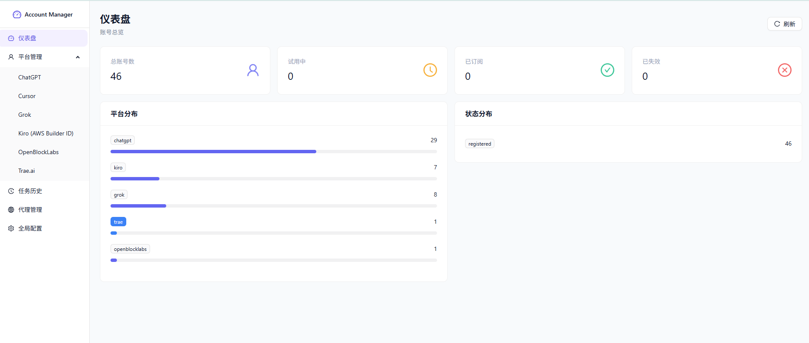
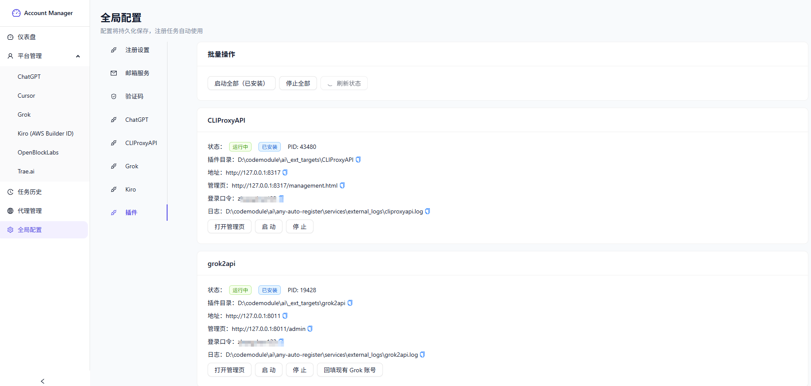

# Any Auto Register

<p align="center">
  <a href="https://linux.do" target="_blank">
    
  </a>
</p>

> Disclaimer: This project is for learning and research purposes only. It must not be used for any commercial purposes. All consequences arising from the use of this project are solely the responsibility of the user.

Multi-platform automated account registration and management system, supporting plugin-based extensibility, Web UI management, batch registration, state synchronization, and automatic local Turnstile Solver launch.

## Table of Contents

- [Current Interface & Supported Platforms](#current-interface--supported-platforms)
- [Features](#features)
- [Our Products](#our-products)
- [Sponsors](#sponsors)
- [UI Preview](#ui-preview)
- [Tech Stack](#tech-stack)
- [Requirements](#requirements)
- [ChatGPT Specific Features](#chatgpt-specific-features)
- [Email Service Support](#email-service-support)
- [Quick Start](#quick-start)
- [Docker Deployment](#docker-deployment)
- [Plugins & External Dependencies](#plugins--external-dependencies)
- [Common Troubleshooting](#common-troubleshooting)
- [Project Structure](#project-structure)
- [Electron Development Notes](#electron-development-notes)
- [User Discussion Group](#user-discussion-group)
- [Support the Author](#support-the-author)
- [Star History](#star-history)
- [License](#license)

## Current Interface & Supported Platforms

Based on the current frontend code and UI, the **platforms displayed by default in the left "Platform Management" menu** are:

- ChatGPT
- iCloud (Hide My Email)

## Features

- **Multi-platform Account Registration & Management**: Unified account list, details, import, multi-format export, deletion, batch operations
- **iCloud Hide My Email**: Apple ID sign-in (SRP + two-factor auth, or cookie import), batch alias generation, and alias inbox viewing
- **Multiple Executor Modes**: Pure protocol, headless browser, headed browser
- **Multiple Email Service Integration**: Built-in, third-party, self-hosted Worker Email, and more
- **Captcha Support**: YesCaptcha, Local Turnstile Solver (Camoufox)
- **Phone Verification (SMS)**: SmsBower / HeroSMS automatic number rental and OTP retrieval — fully unattended when ChatGPT asks for add-phone
- **Proxy Capability**: Proxy pool rotation, proxy state maintenance, proxy integration during registration
- **Batch Registration**: Supports setting registration count, concurrency, and startup delay per account
- **Real-time Logs**: View registration logs in real-time on the frontend
- **Task History Management**: View history records and batch delete
- **Plugin-based Extensibility**: Integratable external services and independent management panels

## Our Products

Thank you to the following self-operated products for supporting any-auto-register.

| Logo | Name | Description | Website |
| --- | --- | --- | --- |
| <a href="https://faka.gsyun.cloud/" target="_blank"></a> | 阿晨小铺 | 本人经营,诚信稳定 | [https://faka.gsyun.cloud/](https://faka.gsyun.cloud/) |
| <a href="https://api.codelife.eu.cc/" target="_blank">zc-api</a> | zc-api | Relay service for model-calling scenarios such as Claude Code and Codex. 10Gbps bandwidth ensures faster first-token response and stable connectivity. Provides high-availability interfaces, easy integration, and continuous-delivery support, suitable for long-term use by developers and teams. Invoices supported; visit the official site for details. | [https://api.codelife.eu.cc/](https://api.codelife.eu.cc/) |

## Sponsors

Thank you to the following friends and partners for supporting any-auto-register.

| Logo | Name | Description | Website |
| --- | --- | --- | --- |
| <a href="https://www.rapidproxy.io/?code=IFZZROPF1" target="_blank"></a> | RapidProxy | RapidProxy provides stable proxy support for automated registration and account management scenarios.<br><br>RapidProxy offers a global residential IP network, supporting intelligent rotation, stable sessions, and high-concurrency requests, helping developers complete batch tasks more efficiently and optimize the automated execution environment.<br><br>Dynamic residential proxy starting from $0.55/GB, with traffic that remains valid long-term and never expires.<br><br>**Use cases:**<br>Automated registration / Browser automation (Playwright, Selenium) / Multi-account environment management / Data collection tasks<br><br>Register to get 500MB free trial; invite friends to earn up to 15% commission!<br><br>**Exclusive discount code: RAPID10 (10% off)** | [https://www.rapidproxy.io/?code=IFZZROPF1](https://www.rapidproxy.io/?code=IFZZROPF1) |
| <a href="https://www.ipwo.net/?ref=githubanyautoregister" target="_blank"></a> | IPWO | IPWO residential proxies fit browser automation, multi-region network access, data collection, and online business testing.<br><br>For projects like any-auto-register that involve browser automation, proxy pool management, and multi-environment execution, IPWO residential proxies can configure the network environment of different browser sessions, support flexible IP rotation and region selection, and provide a more convenient way to plug proxies into automated tasks.<br><br>195+ regions of rotating and static IP resources, http/https/socks5 supported, free trial available.<br><br>**Exclusive discount code: 0204 (10% off)** | [https://www.ipwo.net/?ref=githubanyautoregister](https://www.ipwo.net/?ref=githubanyautoregister) |

## UI Preview

### Dashboard



### Global Config / Plugin Management



## Tech Stack

| Layer | Technology |
| --- | --- |
| Backend | FastAPI + SQLite (SQLModel) |
| Frontend | React + TypeScript + Vite |
| HTTP | curl_cffi |
| Browser Automation | Playwright / Camoufox |
| ChatGPT Registration Protocol | Pure protocol; Sentinel PoW runs in a Node sandbox |

## Requirements

- Python 3.12+
- Node.js 18+ (used both to build the frontend and as the runtime for the ChatGPT Sentinel PoW solver — **it must be executable at registration time**)
- Conda (recommended)
- Windows (recommended for using the included startup scripts directly)

## ChatGPT Specific Features

In the current version, **ChatGPT is one of the most feature-complete platforms**, supporting not only registration but also Token lifecycle management, status probing, and external system synchronization.

### 1. Registration Protocol

The entire ChatGPT registration pipeline lives in `platforms/chatgpt/protocol/`. It is a **pure protocol implementation that needs no browser**:

- `http_client.py` — TLS-fingerprinted session built on `curl_cffi`
- `auth_flow.py` — drives the OpenAI authorize state machine (registration, OTP, add-phone, Codex OAuth)
- `sentinel_quickjs.py` + `openai_sentinel_quickjs.js` — solve the Sentinel PoW by running OpenAI's real `sdk.js` inside a Node sandbox

> ⚠️ **Sentinel requires a Node runtime.** A hand-rolled PoW token passes the surface check at `/sentinel/req`, but the mail service re-verifies it server-side, so verification emails get dropped silently — the pipeline looks healthy yet the code never arrives. An executable `node` (>= 18) is mandatory; set `OPENAI_SENTINEL_NODE_PATH` to an absolute path if it is not on `PATH`.

There are only three injection points on top of the protocol layer: the mailbox pool adapter (`protocol/mailbox_adapter.py`), the SMS controller (`services/sms_service.py`), and the password-effective callback. Task-level settings are passed as instance parameters and **never written to process environment variables**, so concurrent registration tasks do not interfere with each other.

### 2. ChatGPT Token Mode Switching

The current version provides two ChatGPT registration modes:

- **With RT** (recommended by default)
  - Runs the full Codex OAuth exchange
  - Outputs **Access Token + Refresh Token**
- **Without RT**
  - Skips Codex OAuth (saves roughly 10 seconds per account)
  - Only outputs **Access Token / Session**
  - Features depending on RT may not work

This toggle can be found in:

- Registration task page
- ChatGPT platform registration popup

### 3. ChatGPT Registration Method

The same two places also let you pick which identity registration uses. It combines freely with the token mode above:

- **Email registration** (default)
  - Takes an address from the mailbox pool and reads the emailed code
- **Phone registration**
  - Rents a number from the SMS provider and reads the SMS code; no mailbox is consumed
  - The account is listed under its phone number
- **Phone registration + email binding**
  - Registers with the number first, then binds an address from the mailbox pool and reads one emailed code
  - Once bound, the account is listed under its email and the phone number stays in the account details

Both phone methods need SMS receiving enabled with an API key under **Settings → 手机接码 (Phone SMS)**, otherwise the task fails immediately. The binding step is only accepted while OpenAI keeps add-email in the current authorize flow; when it is rejected the account is still kept and the reason is stored in the account details, so it can be bound later.

### 4. TOTP 2FA Binding

The register task page and the ChatGPT register dialog also carry a **绑定 2FA (Bind 2FA)** switch, **off by default**. With it on, a freshly registered account gets a TOTP second factor bound right away:

- **Fast path**: reuses the registration session to request and activate the secret. The chain finished its verification seconds earlier, so the server still treats it as recently authenticated — no re-login, no extra email, done in seconds.
- **Slow path**: only runs when the fast path fails. It replays the full login chain with email + password before enrolling, which costs one more PoW and usually one more emailed code. Phone-identity accounts have no email to log in with, so they skip it.

The secret is stored with the account (in `extra` under `totp_secret`) and can be copied into an authenticator app from three places: the **2FA 已绑** tag in the list, **复制 2FA 密钥 (Copy 2FA secret)** in the account action menu, and the secret block in the account details. The dialog shown after a manual bind also spells the secret out with its own copy button, and it is printed once in the task log. For secrets in bulk, use an export format such as `email----password----2FA`.

Existing accounts can be bound one at a time from the account action menu (**绑定 2FA**), which likewise tries session reuse first and falls back to a re-login. Like **补 RT (RT backfill)**, that action runs as a background task: a log window opens right away so you can watch which path it took and whether it is waiting on an emailed code, and stop it midway. On success the secret is printed in the log and repeated in a copyable block at the top of the window.

> ⚠️ The server hands out the secret exactly once and no endpoint can retrieve it again. Binding takes effect immediately: every later login for that account needs a rotating code. RT backfill and re-login flows compute it automatically from the stored secret, but losing the secret locks you out of the account for good.

### 5. Phone Verification (add-phone)

OpenAI asks some registrations to bind a phone number. When add-phone is hit, the system rents a number, waits for the SMS, and submits the code without any manual step. Configure it under **Settings → 手机接码 (Phone SMS)**:

| Setting | Description |
| --- | --- |
| Enable SMS | When off, add-phone falls back to the manual number path (`OPENAI_PHONE_NUMBER`) |
| Provider | SmsBower / HeroSMS — both speak the sms-activate `handler_api.php` protocol |
| API Key | Provider key; verify it in place with the "Test balance" button |
| Service code | Providers track stock per service code; OpenAI maps to `dr` |
| Default country ID | Defaults to `52` (Thailand) |
| Auto-pick best country | Picks by ascending price plus stock; an allow-list can restrict the candidates |
| Reuse the same number | Reuses a number within its 20-minute lease until the per-number success cap is reached |
| Per-number timeout / max number swaps / code retries per number | Retry policy when a code does not arrive |

"Query country ranking" lists price and stock per country for the given service code; green tags mark countries where OpenAI still uses plain SMS.

> ⚠️ Since 2025 OpenAI has moved most countries to WhatsApp verification. In practice only **Thailand (country_id=52)** reliably stays on plain SMS. Other countries may hand you a WhatsApp-only number and no SMS will arrive; auto-selection warns about this but does not block it.

Country ID, per-number timeout, and max number swaps can additionally be overridden per task on the registration task page. The provider and API key are maintained only in the global settings.

### 6. ChatGPT Batch Status Sync & Re-upload

At the top of the ChatGPT platform list, there are two types of batch capabilities:

- **Status Sync**
  - Sync selected accounts' local status
  - Sync selected accounts' CLIProxyAPI status
  - Or batch execute on current filter results
- **Re-upload accounts not found on remote**
  - Re-upload auth-files not found on the remote
  - Supports "current filter scope" or "currently selected accounts"

### 7. Multi-format Batch Export

**导出 (Export)** at the top right of the account list opens the export dialog: pick the scope (checked accounts, or every account matching the current filters regardless of paging), pick a format, read the preview, then copy or download it.

| Format | What one line looks like |
| --- | --- |
| `email_pw` | `email----password` |
| `email_pw_2fa` | `email----password----2FA secret` |
| `email_pw_2fa_at` | plus `----AccessToken` |
| `email_pw_2fa_rt` | plus `----RefreshToken` |
| `email_pw_2fa_at_rt` | every login and API credential on one line |
| `email_pw_2fa_phone` | plus `----phone number` |
| `email_pw_rt` | `email----password----RefreshToken` |
| `email_2fa` | `email----2FA secret` |
| `at` / `rt` / `totp` | one token per line; accounts without that field are skipped |
| `csv` / `json` | every field, for Excel or scripts |

Empty fields keep their separator (the trailing one in `a@b.com----pw----` is not dropped), so scripts splitting on `----` never shift columns. The catalog lives in `EXPORT_FORMATS` in `services/account_export.py`; adding a format is a one-place change and the frontend dropdown picks it up automatically.

## Email Service Support

Based on the actual configuration in the registration page, the project supports the following email services:

| Service Name | Identifier | Description |
| --- | --- | --- |
| LuckMail | `luckmail` | Free to claim for testing, **daily check-in to continue receiving emails** |
| MoeMail | `moemail` | Default common solution, auto-registers accounts and generates emails |
| TempMail.lol | `tempmail_lol` | Temporary email, some regions may require a proxy |
| SkyMail (CloudMail) | `skymail` | Used via API / Token / Domain |
| YYDS Mail / MaliAPI | `maliapi` | Supports domain and automatic domain strategy |
| GPTMail | `gptmail` | Generates temporary emails via GPTMail API with rotation, supports random address assembly when domains are known |
| DuckMail | `duckmail` | Temporary email solution |
| Freemail | `freemail` | Self-hosted email service |
| Laoudo | `laoudo` | Fixed email solution |
| CF Worker | `cfworker` | Self-hosted email via Cloudflare Worker |

### iCloud Hide My Email Notes

The iCloud platform does not consume the temporary mailboxes listed above; it uses Apple's own Hide My Email addresses instead:

1. Add an Apple ID primary account under "iCloud Hide My Email → Accounts", either way:
   - **Password sign-in**: runs Apple's SRP protocol and walks through two-factor auth when required (trusted-device push or SMS code);
   - **Cookie import**: paste iCloud cookies exported from your browser.
2. Once signed in, generate aliases in bulk from the "Aliases" tab. Apple caps this at **5 aliases per hour**, and the backend throttles per primary account accordingly.
3. The account's IMAP password (an app-specific password) is used to read alias inboxes. All credentials are encrypted with AES-256-GCM before being persisted.

The encryption key comes from the `CREDENTIAL_ENCRYPTION_KEY` environment variable; when unset, a local key is generated at `.secrets/credential_key`.

## Quick Start

### 1. Create and Activate Conda Environment

```bash
conda create -n any-auto-register python=3.12 -y
conda activate any-auto-register
```

### 2. Install Backend Dependencies

```bash
pip install -r requirements.txt
```

### 3. Install Browser Dependencies

```bash
python -m playwright install chromium
python -m camoufox fetch
```

### 4. Install and Build Frontend

```bash
cd frontend
npm install
npm run build
cd ..
```

After building, static assets are output to:

```text
./static
```

### 5. Start the Project

#### Recommended for Windows

PowerShell:

```powershell
.\start_backend.ps1
```

CMD:

```bat
start_backend.bat
```

#### Manual Start

```bash
conda activate any-auto-register
python main.py
```

After starting, access at:

```text
http://localhost:8000
```

> If you've already run `npm run build`, the frontend is served by FastAPI directly, so you access `8000`, not `5173`.

## Windows Startup Scripts

The repo includes the following scripts:

- `start_backend.bat`
- `start_backend.ps1`
- `stop_backend.bat`
- `stop_backend.ps1`

These scripts force the `any-auto-register` conda environment for starting/stopping the backend, avoiding common issues:

- Backend starts but Solver doesn't launch
- `ModuleNotFoundError: quart`
- Turnstile Solver on frontend always shows "Not Running"

To stop services, run:

PowerShell:

```powershell
.\stop_backend.ps1
```

CMD:

```bat
stop_backend.bat
```

By default, this stops:

- Backend port: `8000`
- Solver port: `8889`

## Frontend Development Mode

Suitable for debugging React pages.

### Terminal 1: Start Backend

```powershell
.\start_backend.ps1
```

### Terminal 2: Start Vite

```bash
cd frontend
npm run dev
```

Access at:

```text
http://localhost:5173
```

Vite proxies `/api` requests to the backend at `http://localhost:8000`.

## Turnstile Solver

### Auto Start

The local Turnstile Solver is automatically launched when the FastAPI backend starts, defaulting to:

```text
http://localhost:8889
```

The frontend "Global Config → Captcha → Turnstile Solver" shows the **detection result from the backend**, therefore:

- Backend not started → Frontend shows "Not Running"
- Backend started but wrong conda environment → Solver may fail to start

### Manual Solver Start

```bash
conda activate any-auto-register
python services/turnstile_solver/start.py --browser_type camoufox --port 8889
```

### Solver Logs

If startup fails, check:

```text
services/turnstile_solver/solver.log
```

## Docker Deployment

The repo root includes:

- `Dockerfile`
- `docker-compose.yml`

Default deployment includes:

- FastAPI Backend
- Built frontend static assets
- SQLite database persistence at `./data`
- Local Turnstile Solver auto-launched with the backend

### Start

```bash
docker compose up -d --build
```

The first build will additionally download Python dependencies, Playwright Chromium, and Camoufox, so it will take noticeably longer.

The current Dockerfile now installs Camoufox via direct links to avoid GitHub Releases API anonymous rate limiting.

### Access

```text
http://localhost:8000
```

### Stop

```bash
docker compose down
```

### View Logs

```bash
docker compose logs -f app
```

### Data Persistence

The container defaults to:

```text
DATABASE_URL=sqlite:////app/data/account_manager.db
```

The host machine mounts to:

```text
./data
```

### Common Environment Variables

| Variable | Default | Description |
| --- | --- | --- |
| `HOST` | `0.0.0.0` | FastAPI listen address |
| `PORT` | `8000` | FastAPI listen port |
| `DATABASE_URL` | `sqlite:////app/data/account_manager.db` | SQLite database path |
| `APP_ENABLE_SOLVER` | `1` | Whether to auto-start Solver, set to `0` to disable |
| `SOLVER_PORT` | `8889` | Solver listen port |
| `LOCAL_SOLVER_URL` | `http://127.0.0.1:8889` | Backend access URL for Solver |
| `OPENAI_SENTINEL_NODE_PATH` | `node` | Node executable used by the Sentinel PoW solver; set an absolute path when `node` is not on `PATH` |

To change settings like `OPENAI_*`, simply write them to the `.env` file in the repo root, and `docker compose` will automatically inject them into the container environment.

### Camoufox Build Parameters

To override the upstream version, specify during build:

```bash
CAMOUFOX_VERSION=135.0.1 CAMOUFOX_RELEASE=beta.24 docker compose build app
```

### Docker Usage Notes

- The current Docker image primarily covers the main application and local Turnstile Solver
- Auto-install/launch logic for `CLIProxyAPI` still favors the host machine environment
- If you depend on `conda`, Go, or Windows executables, it is not recommended to run these directly in the current Linux container
- If you only need Web UI, account management, task scheduling, and local Solver, the current Compose configuration works out of the box

## Plugins & External Dependencies

### Temporary Email Source

The project supports self-hosting temporary email via Cloudflare Worker, sourced from:

- <https://github.com/dreamhunter2333/cloudflare_temp_email>

### External Plugin Git URLs

The project currently supports on-demand installation/launch of the following external components:

| Project | Purpose | Git URL |
| --- | --- | --- |
| CLIProxyAPI | CPA / Proxy pool management service | `https://github.com/router-for-me/CLIProxyAPI.git` |

The **"Install Latest / Update to Latest"** button in the plugin page syncs the latest code from the repo, and now supports **uninstallation** (stops the service first, then deletes the local plugin directory).
By default, it updates to the **latest semver tag**; you can also switch back to **branch HEAD** mode in "Settings → Plugins → Install/Update Strategy".

If you need to change to `ghproxy`, `gitclone`, enterprise Git mirrors, or other proxy addresses, you'll need to also modify:

```text
services/external_apps.py
```

## Common Troubleshooting

### 1. Turnstile Solver Shows "Not Running" on Frontend

First check if the backend is running:

```bash
curl http://localhost:8000/api/solver/status
```

Normal response:

```json
{"running":true}
```

If port `8000` is unreachable, the issue is with the backend, not the Solver.

### 2. `ModuleNotFoundError: quart`

The Python used to start the backend is not the `any-auto-register` environment. Use:

```powershell
.\start_backend.ps1
```

or:

```bat
start_backend.bat
```

### 3. Verify the Correct Python

```bash
python -c "import sys; print(sys.executable)"
```

Expected output:

```text
D:\miniconda\conda3\envs\any-auto-register\python.exe
```

### 4. Solver Opens but Status is Still Abnormal

Check both addresses:

```text
http://localhost:8000/api/solver/status
http://localhost:8889/
```

If the second one works but the first doesn't, the issue is with the backend, not the Solver.

### 5. Port Already in Use

If you get `WinError 10048` on startup, first run:

```powershell
.\stop_backend.ps1
```

Then restart:

```powershell
.\start_backend.ps1
```

### 6. ChatGPT registration never receives a verification code

First confirm `node` is executable:

```bash
node --version
```

The Sentinel PoW solver runs OpenAI's `sdk.js` inside a Node sandbox. Without Node, the computed token fails OpenAI's server-side re-verification and **the verification email is dropped silently** — no obvious error shows up in the logs, but the code never arrives. If `node` is not on `PATH`, point `OPENAI_SENTINEL_NODE_PATH` at an absolute path.

## Project Structure

```text
any-auto-register/
├── api/
├── core/
├── docs/
├── electron/
├── frontend/
├── platforms/
├── services/
│   ├── solver_manager.py
│   └── turnstile_solver/
├── static/
├── tests/
├── main.py
├── requirements.txt
├── docker-compose.yml
├── Dockerfile
├── start_backend.bat
├── start_backend.ps1
├── stop_backend.bat
└── stop_backend.ps1
```

## Electron Development Notes

Electron development mode does NOT auto-start the Python backend.

You must first start the backend from the project root:

```powershell
.\start_backend.ps1
```

Then run Electron.

## User Discussion Group

- QQ Group: **1065114376** (any-auto-register registration tool user discussion group)

## Support the Author

If this project has been helpful to you, please support the author to continue maintaining and updating the project.


## Star History

<a href="https://star-history.dera.page/#zc-zhangchen/any-auto-register&type=date&legend=top-left">
 <picture>
   <source media="(prefers-color-scheme: dark)" srcset="https://star-history.dera.page/image?repos=zc-zhangchen/any-auto-register&type=date&theme=dark&legend=top-left" />
   <source media="(prefers-color-scheme: light)" srcset="https://star-history.dera.page/image?repos=zc-zhangchen/any-auto-register&type=date&legend=top-left" />
   
 </picture>
</a>

## License

MIT License — For learning and research purposes only. Commercial use is prohibited.
